# 人力资源管理系统 - 技术解决方案

---

## 0. 软件业务范围界定

### 0.1 业务背景

随着企业规模的不断扩大和人力资源管理需求的日益复杂，传统的人工管理方式已无法满足企业高效、精准的管理要求。为了提升人力资源管理的信息化水平，规范业务流程，提高管理效率，特开发本人力资源管理系统。

本系统旨在为企业提供一个集成化的人力资源管理平台，覆盖员工管理、部门管理、考勤管理、请假管理、工资管理、绩效考核、培训管理、公积金管理和通知公告等核心业务模块，实现人力资源管理的全面数字化。

### 0.2 业务目标

| 目标编号 | 目标名称 | 描述 |
| :--- | :--- | :--- |
| BG_01 | 提升管理效率 | 通过自动化流程替代人工操作，减少重复劳动，提高人力资源管理效率 |
| BG_02 | 规范业务流程 | 建立标准化的业务流程，确保各项人力资源管理活动符合企业制度和法律法规 |
| BG_03 | 数据集中管理 | 实现员工信息、考勤数据、工资数据等的集中存储和统一管理 |
| BG_04 | 决策支持 | 提供数据统计和分析功能，为企业人力资源决策提供数据支撑 |
| BG_05 | 员工自助服务 | 为员工提供便捷的自助服务功能，提升员工满意度 |

### 0.3 业务范围

#### 0.3.1 包含的业务模块

| 模块编号 | 模块名称 | 业务内容 | 涉及角色 |
| :--- | :--- | :--- | :--- |
| BM_01 | 用户认证模块 | 用户登录、退出、权限验证 | 系统管理员、部门管理员、普通员工 |
| BM_02 | 员工管理模块 | 员工信息的增删改查、入职登记、离职处理 | 系统管理员 |
| BM_03 | 部门管理模块 | 部门信息的增删改查、组织架构管理 | 系统管理员 |
| BM_04 | 考勤管理模块 | 上班打卡、下班打卡、考勤记录查询、考勤状态修改 | 系统管理员、部门管理员、普通员工 |
| BM_05 | 请假管理模块 | 请假申请、请假审批、请假记录查询 | 系统管理员、部门管理员、普通员工 |
| BM_06 | 工资管理模块 | 工资记录的增删改查、工资计算、工资发放 | 系统管理员 |
| BM_07 | 绩效考核模块 | 绩效考核记录的增删改查、绩效评估、绩效等级计算 | 系统管理员、部门管理员、普通员工 |
| BM_08 | 培训管理模块 | 培训活动的创建与管理、培训报名、培训报名取消 | 系统管理员、部门管理员、普通员工 |
| BM_09 | 公积金管理模块 | 公积金账户管理、公积金缴存、公积金提取、公积金封存解封、账务查询 | 系统管理员、普通员工 |
| BM_10 | 通知公告模块 | 通知公告的发布、编辑、删除、查看 | 系统管理员、普通员工 |

#### 0.3.2 不包含的业务范围

| 排除项 | 说明 |
| :--- | :--- |
| 招聘管理 | 员工招聘流程管理（简历筛选、面试安排等）不在本系统范围内 |
| 社保管理 | 社会保险的缴纳、申报等业务不在本系统范围内 |
| 员工关系 | 劳动合同管理、劳动纠纷处理等员工关系业务不在本系统范围内 |
| 财务管理 | 除工资发放外的其他财务业务（如报销、预算等）不在本系统范围内 |
| 考勤设备集成 | 与指纹打卡机、人脸识别设备等硬件的直接集成不在本系统范围内 |
| 移动端应用 | 本系统为Web端应用，不包含iOS、Android移动端开发 |

### 0.4 业务流程总览

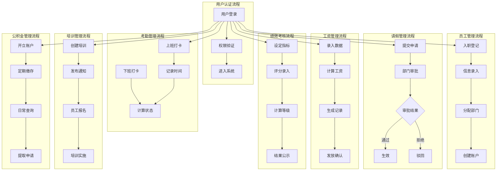

### 0.5 系统边界

#### 0.5.1 系统内部边界

本系统内部包含以下核心子系统：

| 子系统 | 职责 |
| :--- | :--- |
| 用户认证子系统 | 负责用户身份验证、权限管理、会话管理 |
| 员工信息子系统 | 负责员工基本信息的管理和维护 |
| 组织架构子系统 | 负责部门、岗位等组织架构信息的管理 |
| 考勤子系统 | 负责考勤打卡、记录统计、状态管理 |
| 请假子系统 | 负责请假申请、审批流程管理 |
| 薪酬子系统 | 负责工资计算、发放管理 |
| 绩效子系统 | 负责绩效考核、评估管理 |
| 培训子系统 | 负责培训活动、报名管理 |
| 公积金子系统 | 负责公积金账户、缴存提取管理 |
| 通知子系统 | 负责通知公告的发布和展示 |

#### 0.5.2 系统外部接口

| 接口编号 | 接口名称 | 描述 | 数据流向 |
| :--- | :--- | :--- | :--- |
| IF_01 | 数据库接口 | 与MySQL数据库的数据交互 | 双向 |
| IF_02 | 文件上传接口 | 员工照片、培训资料等文件上传 | 外部→系统 |
| IF_03 | 邮件通知接口 | 审批结果、重要通知的邮件发送 | 系统→外部 |
| IF_04 | 报表导出接口 | 考勤报表、工资报表等数据导出 | 系统→外部 |

### 0.6 业务约束

| 约束编号 | 约束名称 | 描述 |
| :--- | :--- | :--- |
| BC_01 | 数据安全约束 | 员工工资、公积金等敏感信息需加密存储和传输 |
| BC_02 | 权限约束 | 不同角色只能访问和操作其权限范围内的功能和数据 |
| BC_03 | 时间约束 | 考勤打卡时间需在规定时段内，逾期无法打卡 |
| BC_04 | 审批流程约束 | 请假申请必须经过部门管理员审批才能生效 |
| BC_05 | 数据一致性约束 | 员工信息变更需同步更新相关联的其他模块数据 |

### 0.7 未实现功能清单

基于需求文档与系统实际实现的对比，以下功能尚未实现：

#### 0.7.1 完全未实现的模块

| 模块名称 | 需求描述 | 未实现原因 |
| :--- | :--- | :--- |
| ~~人员调动管理~~ | ~~公司外调动、公司内调动（部门间人员调动、人员增加、人员离退、人员除名），离退除名人员保留全部信息，调动时工资及个人信息自动修改~~ | **✅ 已实现（2026-06-26）** |
| 劳动管理 | 车间人员分布情况报表、车间人员表，手动输入为主，统一传到综合管理处进行统计合计 | 系统未包含劳动管理相关实体和业务逻辑 |
| 劳动保险管理 | 需求中提及但未详细描述 | 系统未包含劳动保险相关模块 |

#### 0.7.2 部门、人员管理模块未实现功能

| 功能类别 | 需求功能 | 当前状态 |
| :--- | :--- | :--- |
| 部门信息 | 部门编码、部门备注 | **✅ 已实现** |
| 人员基本信息 | 照片、职工编号、年龄、性别、出生日期、民族、政治面貌、婚否 | **✅ 已实现** |
| 人员教育信息 | 职称、专业、学历、毕业学校、毕业时间 | **✅ 已实现** |
| 人员工作信息 | 身份证号、班组、入厂时间、参加工作时间、类别（工人、干部、临时工） | **✅ 已实现** |
| 人员合同信息 | 合同期限（起止时间） | **✅ 已实现** |
| 人员家庭信息 | 家庭住址 | **✅ 已实现** |
| 查询统计 | 根据任意项目进行查询、统计并形成报表 | 部分实现，已有分页搜索、多条件筛选，无复杂报表导出 |
| 工资报表 | 工资按（公司、部门、车间、班组）形成工资明细表和工资汇总表 | 未实现 |

#### 0.7.3 工资管理模块未实现功能

| 功能类别 | 需求功能 | 当前状态 |
| :--- | :--- | :--- |
| 工资项目 | 工资卡号、工资归档、岗位分类（干部、工人、临时工、退养人员、待岗长病）、人员类别（生产人员、辅助人员、管理人员） | 未实现，当前仅有基本工资、奖金、扣款、实发工资 |
| 工资计算项 | 原基本工资、基础工资、工龄（每年一月自动加1）、工龄津贴、副食补贴 | 未实现 |
| 工资计算项 | 工时完成率、质量否决权系数、出勤天数（正常为21天）、应发基本工资 | 未实现 |
| 工资补贴项 | 工回补贴、房补、保健费、夜餐费、加班费、病产假、弹补、弹扣、班组长补助 | 未实现 |
| 工资扣款项 | 保险金、所得税、房费、水费 | 未实现 |
| 工资合计 | 应发工资、扣款、实发额 | 部分实现（仅有实发工资） |
| 灵活配置 | 工资计算方式自定义，工资字段可增加、修改、删除 | 未实现 |
| 批量录入 | 部门批量录入相同项目，个别手动修改 | 未实现 |
| 工资表上传 | 各部门形成工资表后上传到综合管理处 | 未实现 |
| 权限管理 | 各部门权限由管理人员授权 | 未实现 |
| 工资分析 | 分类统计（按公司、部门、类别、岗位）、形成报表和柱型图 | 未实现，仅有基础数据统计页面 |
| 工资条打印 | 打印工资条 | 未实现 |
| 报盘功能 | 按照有无工资卡号形成报表 | 未实现 |
| 汇总报表 | 部门明细表、公司明细表、部门汇总表、公司汇总表、分类汇总表 | 未实现 |

#### 0.7.4 公积金管理模块未实现功能

| 功能类别 | 需求功能 | 当前状态 |
| :--- | :--- | :--- |
| 封户查询 | 封户人员查询、修改操作 | 部分实现，有封存状态但无专门的封户人员查询功能 |
| 余额自动计算 | 每月缴存时余额自动增加（余额=原余额+单位缴额+个人缴额） | 部分实现，缴存功能未完全自动化 |
| 调动封户 | 人员公司外调动或离退时公积金自动封户 | 未实现，无人员调动模块 |
| 权限控制 | 仅公积金管理人员可操作 | 未实现精细权限控制 |
| 账务汇总 | 按时间段、借方、贷方汇总 | 未实现，仅有基础查询 |

#### 0.7.5 职工培训管理模块未实现功能

| 功能类别 | 需求功能 | 当前状态 |
| :--- | :--- | :--- |
| 培训计划 | 培训计划、执行情况、培训台账三部分 | 部分实现，仅有培训活动基本信息 |
| 计划内容 | 参加人数、要求 | 未实现 |
| 执行情况 | 老师、人员学习情况、得分 | 未实现，仅有培训参与记录 |
| 培训台账 | 培训体现在人事档案中 | 未实现 |
| 统计功能 | 根据培训时间、地点、得分情况统计 | 未实现 |

#### 0.7.6 职工考核管理模块未实现功能

| 功能类别 | 需求功能 | 当前状态 |
| :--- | :--- | :--- |
| 考核内容 | 出勤、工作质量、工作态度 | 部分实现（工作质量、工作态度、团队协作、创新能力） |
| 人事档案关联 | 考核得分与人事档案中的考核得分联系，每次考核时间对应 | 未实现 |
| 缺勤标识 | 缺勤人员界面颜色改变，缺勤人员专门记录在缺勤库中 | 未实现 |
| 岗位变动 | 人员岗位变动时颜色改变，可查看变动前后岗位情况 | 未实现 |

#### 0.7.7 功能实现情况总览

| 模块名称 | 需求模块数 | 已实现模块数 | 完整度 |
| :--- | :--- | :--- | :--- |
| 部门、人员管理 | 10+ | 2 | ~20% |
| 工资管理 | 30+ | 4 | ~13% |
| 人员调动管理 | 8 | 0 | 0% |
| 公积金管理 | 8 | 5 | ~63% |
| 职工培训管理 | 7 | 3 | ~43% |
| 职工考核管理 | 5 | 2 | ~40% |
| 劳动管理 | 4 | 0 | 0% |
| 劳动保险管理 | - | 0 | 0% |
| **合计** | **70+** | **16** | **~23%** |

---

## 1. 系统需求建模

### 1.1 系统用例模型

#### 1.1.1 系统参与者列表

| 编号 | 名称 | 描述 |
| :--- | :--- | :--- |
| SA_01 | 系统管理员 | 负责系统全局管理，包括员工管理、部门管理、系统配置等 |
| SA_02 | 部门管理员 | 负责本部门员工管理、考勤审批、绩效评估等部门级业务 |
| SA_03 | 普通员工 | 使用系统进行日常打卡、请假申请、查看工资和绩效等个人业务 |

#### 1.1.2 系统用例列表

| 编号 | 名称 | 描述 |
| :--- | :--- | :--- |
| UC_01 | 用户登录 | 系统参与者通过用户名和密码登录系统 |
| UC_02 | 用户退出 | 用户退出登录状态 |
| UC_03 | 员工信息管理 | 管理员查看、添加、编辑、删除员工信息 |
| UC_04 | 部门信息管理 | 管理员查看、添加、编辑、删除部门信息 |
| UC_05 | 上班打卡 | 员工进行上班打卡操作 |
| UC_06 | 下班打卡 | 员工进行下班打卡操作 |
| UC_07 | 考勤记录查询 | 员工和管理员查看考勤记录 |
| UC_08 | 考勤状态修改 | 管理员修改考勤记录状态 |
| UC_09 | 请假申请 | 员工提交请假申请 |
| UC_10 | 请假审批 | 部门管理员或系统管理员审批请假申请 |
| UC_11 | 工资信息查看 | 员工查看个人工资信息 |
| UC_12 | 工资记录管理 | 管理员添加、编辑、删除工资记录 |
| UC_13 | 绩效考核管理 | 管理员添加、编辑、删除绩效考核记录 |
| UC_14 | 绩效信息查看 | 员工查看个人绩效考核结果 |
| UC_15 | 培训信息管理 | 管理员创建、编辑、删除培训活动 |
| UC_16 | 培训报名 | 员工报名参加培训活动 |
| UC_17 | 培训报名取消 | 员工取消已报名的培训 |
| UC_18 | 公积金账户管理 | 管理员添加、编辑、删除公积金账户 |
| UC_19 | 公积金缴存 | 管理员进行公积金缴存操作 |
| UC_20 | 公积金提取 | 员工申请公积金提取 |
| UC_21 | 公积金封存解封 | 管理员对公积金账户进行封存或解封 |
| UC_22 | 公积金账务查询 | 员工查看个人公积金账务记录 |
| UC_23 | 通知公告管理 | 管理员发布、编辑、删除通知公告 |
| UC_24 | 通知公告查看 | 员工查看系统通知公告 |

#### 1.1.3 系统用例图

```mermaid
graph TD
    SA01([系统管理员])
    SA02([部门管理员])
    SA03([普通员工])
    
    UC01(用户登录)
    UC02(用户退出)
    UC03(员工管理)
    UC04(部门管理)
    UC05(上班打卡)
    UC06(下班打卡)
    UC07(考勤查询)
    UC08(考勤修改)
    UC09(请假申请)
    UC10(请假审批)
    UC11(工资查看)
    UC12(工资管理)
    UC13(绩效评估)
    UC14(绩效查看)
    UC15(培训管理)
    UC16(培训报名)
    UC17(公积金管理)
    UC18(公积金缴存)
    UC19(公积金提取)
    UC20(通知公告)
    
    SA01 --> UC01
    SA01 --> UC02
    SA01 --> UC03
    SA01 --> UC04
    SA01 --> UC07
    SA01 --> UC08
    SA01 --> UC10
    SA01 --> UC12
    SA01 --> UC13
    SA01 --> UC15
    SA01 --> UC17
    SA01 --> UC18
    SA01 --> UC20
    
    SA02 --> UC01
    SA02 --> UC02
    SA02 --> UC07
    SA02 --> UC10
    SA02 --> UC13
    SA02 --> UC15
    
    SA03 --> UC01
    SA03 --> UC02
    SA03 --> UC05
    SA03 --> UC06
    SA03 --> UC07
    SA03 --> UC09
    SA03 --> UC11
    SA03 --> UC14
    SA03 --> UC16
    SA03 --> UC19
    SA03 --> UC20
```

#### 1.1.4 用例文档

##### UC_01 用户登录

| 项目 | 内容 |
| :--- | :--- |
| 用例编号 | UC_01 |
| 用例名称 | 用户登录 |
| 简要描述 | 系统参与者通过用户名和密码登录系统 |
| 涉及参与者 | SA_01 系统管理员、SA_02 部门管理员、SA_03 普通员工 |
| 前置条件 | 用户已注册账号，系统处于运行状态 |
| 后置条件 | 用户成功登录，系统记录登录状态 |

**正常流程：**

| 步骤 | 参与者 | 系统操作 |
| :--- | :--- | :--- |
| 1 | 用户 | 打开登录页面，输入用户名和密码 |
| 2 | 用户 | 点击登录按钮 |
| 3 | 系统 | 验证用户名和密码 |
| 4 | 系统 | 验证通过，跳转至首页 |

**异常流程：**

| 步骤 | 异常情况 | 系统处理 |
| :--- | :--- | :--- |
| 1 | 用户名为空 | 提示"请输入用户名" |
| 2 | 密码为空 | 提示"请输入密码" |
| 3 | 用户名不存在 | 提示"用户名或密码错误" |
| 4 | 密码错误 | 提示"用户名或密码错误" |

---

##### UC_02 用户退出

| 项目 | 内容 |
| :--- | :--- |
| 用例编号 | UC_02 |
| 用例名称 | 用户退出 |
| 简要描述 | 用户退出当前登录状态 |
| 涉及参与者 | SA_01 系统管理员、SA_02 部门管理员、SA_03 普通员工 |
| 前置条件 | 用户已登录系统 |
| 后置条件 | 用户退出登录，清除登录状态 |

**正常流程：**

| 步骤 | 参与者 | 系统操作 |
| :--- | :--- | :--- |
| 1 | 用户 | 点击退出按钮 |
| 2 | 系统 | 清除登录状态 |
| 3 | 系统 | 跳转至登录页面 |

---

##### UC_03 员工信息管理

| 项目 | 内容 |
| :--- | :--- |
| 用例编号 | UC_03 |
| 用例名称 | 员工信息管理 |
| 简要描述 | 管理员查看、添加、编辑、删除员工信息 |
| 涉及参与者 | SA_01 系统管理员 |
| 前置条件 | 系统管理员已登录 |
| 后置条件 | 员工信息更新成功 |

**正常流程：**

| 步骤 | 参与者 | 系统操作 |
| :--- | :--- | :--- |
| 1 | 管理员 | 进入员工管理页面 |
| 2 | 系统 | 显示员工列表 |
| 3 | 管理员 | 选择操作（添加/编辑/删除） |
| 4 | 系统 | 执行相应操作 |

**异常流程：**

| 步骤 | 异常情况 | 系统处理 |
| :--- | :--- | :--- |
| 1 | 删除超级管理员 | 提示"不能删除超级管理员" |
| 2 | 用户名重复 | 提示"用户名已存在" |

---

##### UC_04 部门信息管理

| 项目 | 内容 |
| :--- | :--- |
| 用例编号 | UC_04 |
| 用例名称 | 部门信息管理 |
| 简要描述 | 管理员查看、添加、编辑、删除部门信息 |
| 涉及参与者 | SA_01 系统管理员 |
| 前置条件 | 系统管理员已登录 |
| 后置条件 | 部门信息更新成功 |

**正常流程：**

| 步骤 | 参与者 | 系统操作 |
| :--- | :--- | :--- |
| 1 | 管理员 | 进入部门管理页面 |
| 2 | 系统 | 显示部门列表 |
| 3 | 管理员 | 选择操作（添加/编辑/删除） |
| 4 | 系统 | 执行相应操作 |

**异常流程：**

| 步骤 | 异常情况 | 系统处理 |
| :--- | :--- | :--- |
| 1 | 删除包含员工的部门 | 提示"该部门下仍有员工，无法删除" |
| 2 | 部门名称重复 | 提示"部门名称已存在" |

---

##### UC_05 上班打卡

| 项目 | 内容 |
| :--- | :--- |
| 用例编号 | UC_05 |
| 用例名称 | 上班打卡 |
| 简要描述 | 员工进行上班打卡操作 |
| 涉及参与者 | SA_03 普通员工 |
| 前置条件 | 员工已登录，当前时间未超过下班时间 |
| 后置条件 | 打卡记录保存成功 |

**正常流程：**

| 步骤 | 参与者 | 系统操作 |
| :--- | :--- | :--- |
| 1 | 员工 | 进入考勤页面 |
| 2 | 系统 | 显示今日打卡状态 |
| 3 | 员工 | 点击上班打卡按钮 |
| 4 | 系统 | 记录打卡时间 |

**异常流程：**

| 步骤 | 异常情况 | 系统处理 |
| :--- | :--- | :--- |
| 1 | 今日已打卡 | 提示"今日已完成上班打卡" |
| 2 | 超过下班时间 | 提示"已超过下班时间，无法上班打卡" |

---

##### UC_06 下班打卡

| 项目 | 内容 |
| :--- | :--- |
| 用例编号 | UC_06 |
| 用例名称 | 下班打卡 |
| 简要描述 | 员工进行下班打卡操作 |
| 涉及参与者 | SA_03 普通员工 |
| 前置条件 | 员工已登录，已完成上班打卡 |
| 后置条件 | 打卡记录保存成功，系统计算考勤状态 |

**正常流程：**

| 步骤 | 参与者 | 系统操作 |
| :--- | :--- | :--- |
| 1 | 员工 | 进入考勤页面 |
| 2 | 系统 | 显示今日打卡状态 |
| 3 | 员工 | 点击下班打卡按钮 |
| 4 | 系统 | 记录打卡时间，计算考勤状态 |

**异常流程：**

| 步骤 | 异常情况 | 系统处理 |
| :--- | :--- | :--- |
| 1 | 未上班打卡 | 提示"请先进行上班打卡" |
| 2 | 今日已完成 | 提示"今日已完成下班打卡" |

---

##### UC_07 考勤记录查询

| 项目 | 内容 |
| :--- | :--- |
| 用例编号 | UC_07 |
| 用例名称 | 考勤记录查询 |
| 简要描述 | 员工和管理员查看考勤记录 |
| 涉及参与者 | SA_01 系统管理员、SA_02 部门管理员、SA_03 普通员工 |
| 前置条件 | 用户已登录 |
| 后置条件 | 显示考勤记录列表 |

**正常流程：**

| 步骤 | 参与者 | 系统操作 |
| :--- | :--- | :--- |
| 1 | 用户 | 进入考勤查询页面 |
| 2 | 用户 | 设置查询条件（日期范围、员工等） |
| 3 | 系统 | 显示符合条件的考勤记录 |

---

##### UC_08 考勤状态修改

| 项目 | 内容 |
| :--- | :--- |
| 用例编号 | UC_08 |
| 用例名称 | 考勤状态修改 |
| 简要描述 | 管理员修改考勤记录状态 |
| 涉及参与者 | SA_01 系统管理员 |
| 前置条件 | 系统管理员已登录 |
| 后置条件 | 考勤状态更新成功 |

**正常流程：**

| 步骤 | 参与者 | 系统操作 |
| :--- | :--- | :--- |
| 1 | 管理员 | 进入考勤管理页面 |
| 2 | 系统 | 显示考勤记录列表 |
| 3 | 管理员 | 选择需要修改的记录 |
| 4 | 管理员 | 修改状态（正常/迟到/早退/异常） |
| 5 | 系统 | 保存修改 |

---

##### UC_09 请假申请

| 项目 | 内容 |
| :--- | :--- |
| 用例编号 | UC_09 |
| 用例名称 | 请假申请 |
| 简要描述 | 员工提交请假申请 |
| 涉及参与者 | SA_03 普通员工 |
| 前置条件 | 员工已登录 |
| 后置条件 | 请假申请提交成功，状态为待审批 |

**正常流程：**

| 步骤 | 参与者 | 系统操作 |
| :--- | :--- | :--- |
| 1 | 员工 | 进入请假申请页面 |
| 2 | 员工 | 填写请假信息（类型、日期、原因） |
| 3 | 员工 | 提交申请 |
| 4 | 系统 | 保存申请，通知部门管理员 |

**异常流程：**

| 步骤 | 异常情况 | 系统处理 |
| :--- | :--- | :--- |
| 1 | 结束日期早于开始日期 | 提示"结束日期不能早于开始日期" |
| 2 | 请假天数超过上限 | 提示"请假天数超过限制" |

---

##### UC_10 请假审批

| 项目 | 内容 |
| :--- | :--- |
| 用例编号 | UC_10 |
| 用例名称 | 请假审批 |
| 简要描述 | 部门管理员或系统管理员审批请假申请 |
| 涉及参与者 | SA_01 系统管理员、SA_02 部门管理员 |
| 前置条件 | 有待审批的请假申请 |
| 后置条件 | 请假申请状态更新为已批准或已拒绝 |

**正常流程：**

| 步骤 | 参与者 | 系统操作 |
| :--- | :--- | :--- |
| 1 | 管理员 | 进入请假审批页面 |
| 2 | 系统 | 显示待审批列表 |
| 3 | 管理员 | 查看申请详情 |
| 4 | 管理员 | 选择批准或拒绝 |
| 5 | 系统 | 更新申请状态 |

---

##### UC_11 工资信息查看

| 项目 | 内容 |
| :--- | :--- |
| 用例编号 | UC_11 |
| 用例名称 | 工资信息查看 |
| 简要描述 | 员工查看个人工资信息 |
| 涉及参与者 | SA_03 普通员工 |
| 前置条件 | 员工已登录 |
| 后置条件 | 显示个人工资记录 |

**正常流程：**

| 步骤 | 参与者 | 系统操作 |
| :--- | :--- | :--- |
| 1 | 员工 | 进入工资页面 |
| 2 | 系统 | 显示个人工资记录列表 |

---

##### UC_12 工资记录管理

| 项目 | 内容 |
| :--- | :--- |
| 用例编号 | UC_12 |
| 用例名称 | 工资记录管理 |
| 简要描述 | 管理员添加、编辑、删除工资记录 |
| 涉及参与者 | SA_01 系统管理员 |
| 前置条件 | 系统管理员已登录 |
| 后置条件 | 工资记录更新成功 |

**正常流程：**

| 步骤 | 参与者 | 系统操作 |
| :--- | :--- | :--- |
| 1 | 管理员 | 进入工资管理页面 |
| 2 | 系统 | 显示工资记录列表 |
| 3 | 管理员 | 选择操作（添加/编辑/删除） |
| 4 | 系统 | 执行相应操作 |

---

##### UC_13 绩效考核管理

| 项目 | 内容 |
| :--- | :--- |
| 用例编号 | UC_13 |
| 用例名称 | 绩效考核管理 |
| 简要描述 | 管理员添加、编辑、删除绩效考核记录 |
| 涉及参与者 | SA_01 系统管理员、SA_02 部门管理员 |
| 前置条件 | 管理员已登录 |
| 后置条件 | 绩效考核记录更新成功 |

**正常流程：**

| 步骤 | 参与者 | 系统操作 |
| :--- | :--- | :--- |
| 1 | 管理员 | 进入绩效考核页面 |
| 2 | 系统 | 显示考核记录列表 |
| 3 | 管理员 | 选择操作（添加/编辑/删除） |
| 4 | 系统 | 执行相应操作，自动计算综合得分和等级 |

---

##### UC_14 绩效信息查看

| 项目 | 内容 |
| :--- | :--- |
| 用例编号 | UC_14 |
| 用例名称 | 绩效信息查看 |
| 简要描述 | 员工查看个人绩效考核结果 |
| 涉及参与者 | SA_03 普通员工 |
| 前置条件 | 员工已登录 |
| 后置条件 | 显示个人绩效考核记录 |

**正常流程：**

| 步骤 | 参与者 | 系统操作 |
| :--- | :--- | :--- |
| 1 | 员工 | 进入绩效考核页面 |
| 2 | 系统 | 显示个人绩效考核记录 |

---

##### UC_15 培训信息管理

| 项目 | 内容 |
| :--- | :--- |
| 用例编号 | UC_15 |
| 用例名称 | 培训信息管理 |
| 简要描述 | 管理员创建、编辑、删除培训活动 |
| 涉及参与者 | SA_01 系统管理员、SA_02 部门管理员 |
| 前置条件 | 管理员已登录 |
| 后置条件 | 培训信息更新成功 |

**正常流程：**

| 步骤 | 参与者 | 系统操作 |
| :--- | :--- | :--- |
| 1 | 管理员 | 进入培训管理页面 |
| 2 | 系统 | 显示培训列表 |
| 3 | 管理员 | 选择操作（添加/编辑/删除） |
| 4 | 系统 | 执行相应操作 |

---

##### UC_16 培训报名

| 项目 | 内容 |
| :--- | :--- |
| 用例编号 | UC_16 |
| 用例名称 | 培训报名 |
| 简要描述 | 员工报名参加培训活动 |
| 涉及参与者 | SA_03 普通员工 |
| 前置条件 | 员工已登录，培训活动未结束 |
| 后置条件 | 报名成功 |

**正常流程：**

| 步骤 | 参与者 | 系统操作 |
| :--- | :--- | :--- |
| 1 | 员工 | 进入培训列表页面 |
| 2 | 系统 | 显示可报名的培训 |
| 3 | 员工 | 选择培训并点击报名 |
| 4 | 系统 | 记录报名信息 |

**异常流程：**

| 步骤 | 异常情况 | 系统处理 |
| :--- | :--- | :--- |
| 1 | 培训已满 | 提示"该培训人数已满" |
| 2 | 已报名 | 提示"您已报名该培训" |

---

##### UC_17 培训报名取消

| 项目 | 内容 |
| :--- | :--- |
| 用例编号 | UC_17 |
| 用例名称 | 培训报名取消 |
| 简要描述 | 员工取消已报名的培训 |
| 涉及参与者 | SA_03 普通员工 |
| 前置条件 | 员工已登录，已报名某培训 |
| 后置条件 | 报名记录删除成功 |

**正常流程：**

| 步骤 | 参与者 | 系统操作 |
| :--- | :--- | :--- |
| 1 | 员工 | 进入个人培训页面 |
| 2 | 系统 | 显示已报名的培训 |
| 3 | 员工 | 选择培训并点击取消 |
| 4 | 系统 | 删除报名记录 |

---

##### UC_18 公积金账户管理

| 项目 | 内容 |
| :--- | :--- |
| 用例编号 | UC_18 |
| 用例名称 | 公积金账户管理 |
| 简要描述 | 管理员添加、编辑、删除公积金账户 |
| 涉及参与者 | SA_01 系统管理员 |
| 前置条件 | 系统管理员已登录 |
| 后置条件 | 公积金账户信息更新成功 |

**正常流程：**

| 步骤 | 参与者 | 系统操作 |
| :--- | :--- | :--- |
| 1 | 管理员 | 进入公积金管理页面 |
| 2 | 系统 | 显示账户列表 |
| 3 | 管理员 | 选择操作（添加/编辑/删除） |
| 4 | 系统 | 执行相应操作 |

---

##### UC_19 公积金缴存

| 项目 | 内容 |
| :--- | :--- |
| 用例编号 | UC_19 |
| 用例名称 | 公积金缴存 |
| 简要描述 | 管理员进行公积金缴存操作 |
| 涉及参与者 | SA_01 系统管理员 |
| 前置条件 | 系统管理员已登录，账户状态为正常 |
| 后置条件 | 缴存成功，余额更新，生成账务记录 |

**正常流程：**

| 步骤 | 参与者 | 系统操作 |
| :--- | :--- | :--- |
| 1 | 管理员 | 进入公积金缴存页面 |
| 2 | 管理员 | 选择账户，输入缴存金额 |
| 3 | 系统 | 更新账户余额 |
| 4 | 系统 | 生成缴存账务记录 |

---

##### UC_20 公积金提取

| 项目 | 内容 |
| :--- | :--- |
| 用例编号 | UC_20 |
| 用例名称 | 公积金提取 |
| 简要描述 | 员工申请公积金提取 |
| 涉及参与者 | SA_03 普通员工 |
| 前置条件 | 员工已登录，账户状态为正常，余额充足 |
| 后置条件 | 提取申请提交成功 |

**正常流程：**

| 步骤 | 参与者 | 系统操作 |
| :--- | :--- | :--- |
| 1 | 员工 | 进入公积金提取页面 |
| 2 | 员工 | 填写提取金额和原因 |
| 3 | 员工 | 提交申请 |
| 4 | 系统 | 更新账户余额，生成提取账务记录 |

**异常流程：**

| 步骤 | 异常情况 | 系统处理 |
| :--- | :--- | :--- |
| 1 | 余额不足 | 提示"余额不足" |
| 2 | 提取金额为负数 | 提示"提取金额必须大于0" |

---

##### UC_21 公积金封存解封

| 项目 | 内容 |
| :--- | :--- |
| 用例编号 | UC_21 |
| 用例名称 | 公积金封存解封 |
| 简要描述 | 管理员对公积金账户进行封存或解封 |
| 涉及参与者 | SA_01 系统管理员 |
| 前置条件 | 系统管理员已登录 |
| 后置条件 | 账户状态更新成功 |

**正常流程：**

| 步骤 | 参与者 | 系统操作 |
| :--- | :--- | :--- |
| 1 | 管理员 | 进入公积金管理页面 |
| 2 | 系统 | 显示账户列表 |
| 3 | 管理员 | 选择账户，执行封存或解封操作 |
| 4 | 系统 | 更新账户状态 |

---

##### UC_22 公积金账务查询

| 项目 | 内容 |
| :--- | :--- |
| 用例编号 | UC_22 |
| 用例名称 | 公积金账务查询 |
| 简要描述 | 员工查看个人公积金账务记录 |
| 涉及参与者 | SA_03 普通员工 |
| 前置条件 | 员工已登录 |
| 后置条件 | 显示个人公积金账务记录 |

**正常流程：**

| 步骤 | 参与者 | 系统操作 |
| :--- | :--- | :--- |
| 1 | 员工 | 进入公积金账务页面 |
| 2 | 系统 | 显示个人账务记录列表 |

---

##### UC_23 通知公告管理

| 项目 | 内容 |
| :--- | :--- |
| 用例编号 | UC_23 |
| 用例名称 | 通知公告管理 |
| 简要描述 | 管理员发布、编辑、删除通知公告 |
| 涉及参与者 | SA_01 系统管理员 |
| 前置条件 | 系统管理员已登录 |
| 后置条件 | 通知公告更新成功 |

**正常流程：**

| 步骤 | 参与者 | 系统操作 |
| :--- | :--- | :--- |
| 1 | 管理员 | 进入通知公告页面 |
| 2 | 系统 | 显示通知列表 |
| 3 | 管理员 | 选择操作（添加/编辑/删除） |
| 4 | 系统 | 执行相应操作 |

---

##### UC_24 通知公告查看

| 项目 | 内容 |
| :--- | :--- |
| 用例编号 | UC_24 |
| 用例名称 | 通知公告查看 |
| 简要描述 | 员工查看系统通知公告 |
| 涉及参与者 | SA_03 普通员工 |
| 前置条件 | 员工已登录 |
| 后置条件 | 显示通知公告列表 |

**正常流程：**

| 步骤 | 参与者 | 系统操作 |
| :--- | :--- | :--- |
| 1 | 员工 | 进入通知公告页面 |
| 2 | 系统 | 显示通知列表 |
| 3 | 员工 | 点击查看详情 |

---

### 1.2 系统数据描述

#### 1.2.1 重要术语定义

| 术语名称 | 描述 | 数据项 | 关键数据项含义 |
| :--- | :--- | :--- | :--- |
| 员工编号 | 系统中唯一标识员工的编号 | id、name、department、position | id：自增主键，唯一标识 |
| 部门编号 | 系统中唯一标识部门的编号 | id、name、manager、description | id：自增主键，唯一标识 |
| 考勤记录 | 员工每日考勤打卡记录 | id、employeeId、date、clockIn、clockOut、status | status：normal正常/late迟到/early_leave早退/abnormal异常 |
| 请假申请 | 员工提交的请假申请记录 | id、employeeId、type、startDate、endDate、status | type：annual年假/sick病假/personal事假；status：pending待审批/approved已批准/rejected已拒绝 |
| 工资记录 | 员工每月工资发放记录 | id、employeeId、month、baseSalary、bonus、deduction、actualSalary | month：格式为yyyy-MM；actualSalary = baseSalary + bonus - deduction |
| 绩效考核 | 员工周期性绩效评估记录 | id、employeeId、period、workScore、attitudeScore、teamworkScore、innovationScore、totalScore、level | totalScore：四项得分总和；level：A/B/C/D四级 |
| 培训活动 | 公司组织的培训课程 | id、title、trainer、date、location、maxParticipants | maxParticipants：培训人数上限 |
| 培训报名 | 员工报名参加培训的记录 | id、trainingId、employeeId | trainingId：关联培训活动；employeeId：关联员工 |
| 公积金账户 | 员工的公积金账户信息 | id、accountNo、name、balance、status | accountNo：公积金账号，唯一；status：active正常/sealed封存/closed销户 |
| 公积金账务 | 公积金账户的交易记录 | id、fundId、transDate、debit、credit、balance、type | type：缴存/提取/转账；debit：支出；credit：收入 |
| 通知公告 | 系统发布的通知信息 | id、title、content、author、publishDate | publishDate：发布日期 |
| 系统用户 | 系统登录用户信息 | id、username、password、role、employeeId | role：admin系统管理员/dept_admin部门管理员/user普通用户 |

#### 1.2.2 关键数据项构成规则

| 数据项 | 构成规则 | 示例 |
| :--- | :--- | :--- |
| 员工编号(id) | 数据库自增整数，从1开始 | 1, 2, 3, ... |
| 部门编号(id) | 数据库自增整数，从1开始 | 1, 2, 3, ... |
| 考勤状态(status) | 枚举值：normal、late、early_leave、abnormal | normal |
| 请假类型(type) | 枚举值：annual、sick、personal | annual |
| 请假状态(status) | 枚举值：pending、approved、rejected | pending |
| 工资月份(month) | 格式为yyyy-MM | 2024-01 |
| 绩效等级(level) | 枚举值：A、B、C、D | B |
| 公积金账户状态(status) | 枚举值：active、sealed、closed | active |
| 账务类型(type) | 枚举值：deposit缴存、withdraw提取、transfer转账 | deposit |
| 用户角色(role) | 枚举值：admin、dept_admin、user | user |

---

## 2. 技术解决方案

### 2.1 软件架构设计

#### 2.1.1 架构风格

本系统采用 **分层架构（Layered Architecture）** 与 **MVC设计模式** 相结合的架构风格。系统分为表示层、业务逻辑层和数据访问层三个主要层次，各层职责清晰，便于维护和扩展。

**架构特点：**
- **高内聚低耦合**：各层之间通过接口交互，降低依赖关系
- **可扩展性**：支持业务功能的水平扩展和垂直扩展
- **可维护性**：分层设计使代码易于理解和维护

#### 2.1.2 技术框架

| 层次 | 技术选型 | 版本 |
| :--- | :--- | :--- |
| **前端框架** | Vue.js | 3.x |
| **前端构建工具** | Vite | 5.x |
| **状态管理** | Pinia | 2.x |
| **UI组件库** | Element Plus | 2.x |
| **后端框架** | Spring Boot | 3.x |
| **持久层框架** | MyBatis Plus | 3.5.x |
| **数据库** | MySQL | 8.0+ |
| **连接池** | HikariCP | 5.x |

#### 2.1.3 设计模式

| 设计模式 | 应用场景 |
| :--- | :--- |
| **MVC模式** | 前端Vue组件与后端Controller分离 |
| **单例模式** | Spring Bean管理 |
| **策略模式** | 考勤状态判断、绩效等级计算 |
| **模板方法模式** | Service层通用CRUD操作 |
| **DAO模式** | Mapper接口与MyBatis Plus集成 |

#### 2.1.4 架构示意图（简约版）

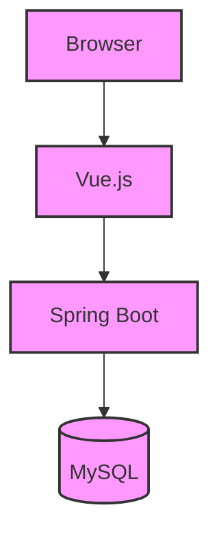

#### 2.1.5 架构示意图（详细版）

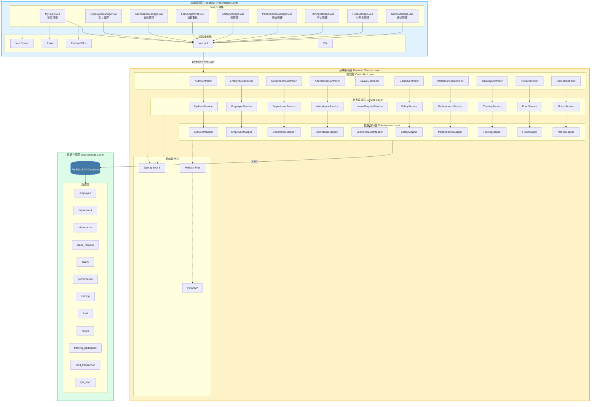

---

### 2.2 开发平台描述

#### 2.2.1 硬件环境

| 类别 | 要求 |
| :--- | :--- |
| **服务器** | CPU: Intel Xeon E5-2620 v4 及以上<br>内存: 16GB 及以上<br>硬盘: SSD 200GB 及以上 |
| **开发机** | CPU: Intel Core i5-8400 及以上<br>内存: 8GB 及以上<br>硬盘: SSD 100GB 及以上 |
| **网络** | 局域网/互联网，带宽 10Mbps 及以上 |

#### 2.2.2 支持环境

| 类别 | 软件 | 版本 |
| :--- | :--- | :--- |
| **操作系统** | Windows Server | 2019/2022 |
| **数据库** | MySQL | 8.0+ |
| **Web服务器** | Nginx | 1.20+ |
| **JDK** | OpenJDK | 21 |
| **Node.js** | Node.js | 20.x |
| **包管理** | npm/pnpm | 10.x/9.x |

#### 2.2.3 开发语言

| 层次 | 语言 | 说明 |
| :--- | :--- | :--- |
| **前端** | JavaScript (ES6+) | Vue.js 3 组件开发 |
| **后端** | Java | Spring Boot 服务端开发 |
| **数据库** | SQL | MySQL 数据操作 |

---

## 3. 系统设计类建模

### 3.1 系统设计类图

#### 3.1.1 用户认证模块类图

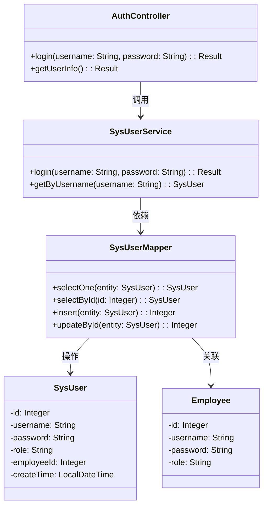

#### 3.1.2 员工管理模块类图

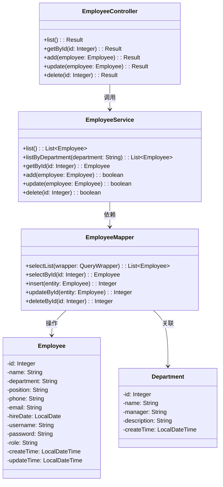

#### 3.1.3 部门管理模块类图

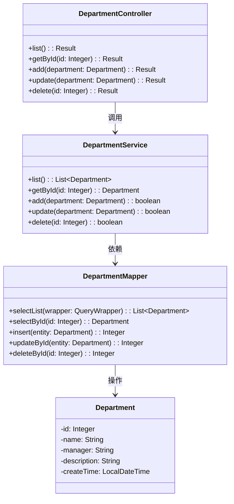

#### 3.1.4 考勤管理模块类图

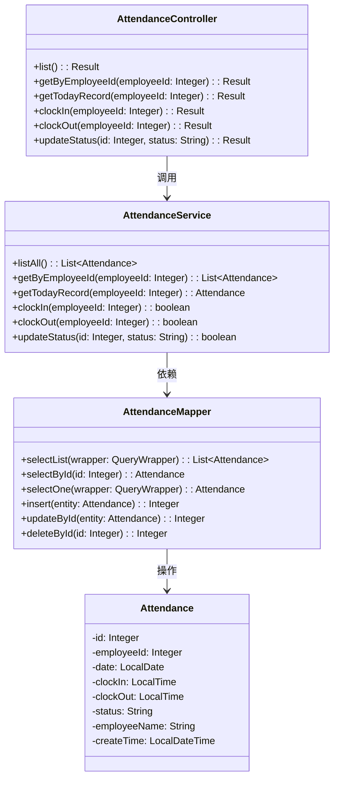

#### 3.1.5 请假管理模块类图

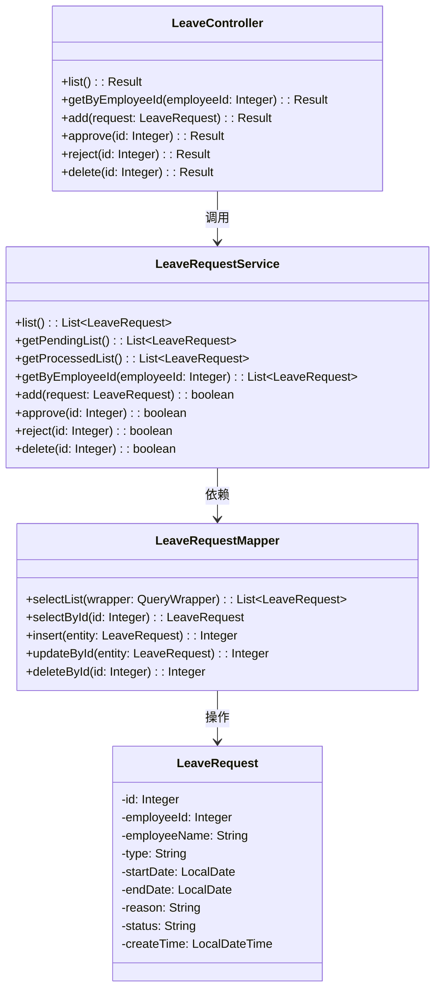

#### 3.1.6 工资管理模块类图

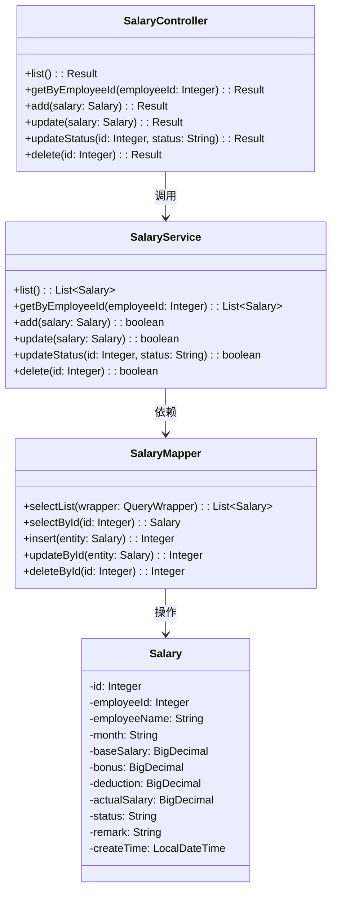

#### 3.1.7 绩效考核模块类图

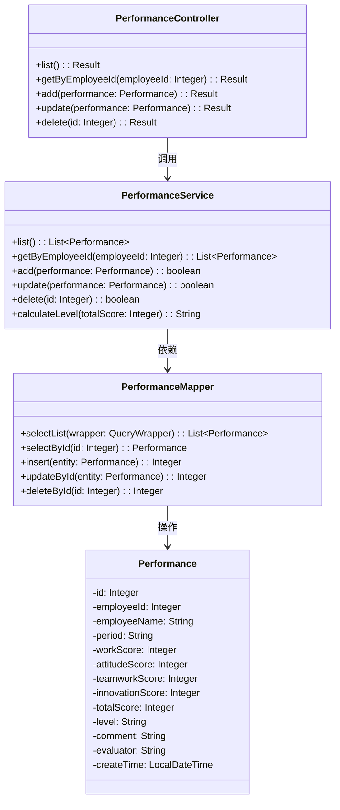

#### 3.1.8 培训管理模块类图

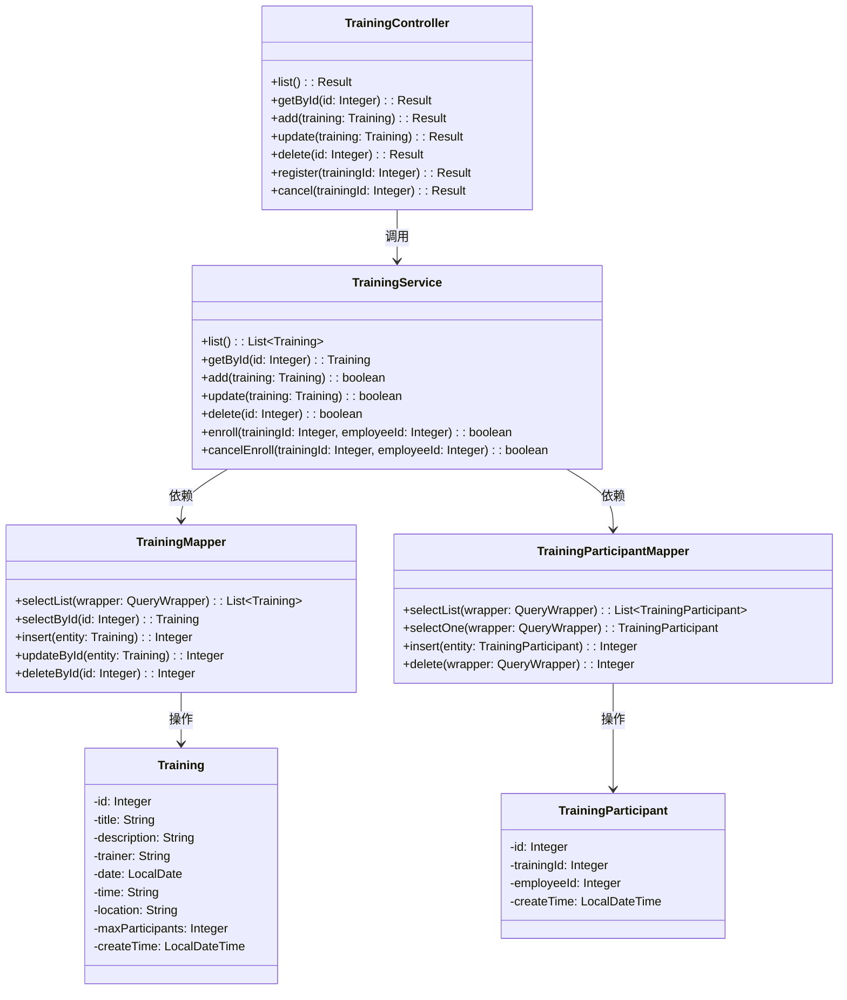

#### 3.1.9 公积金管理模块类图

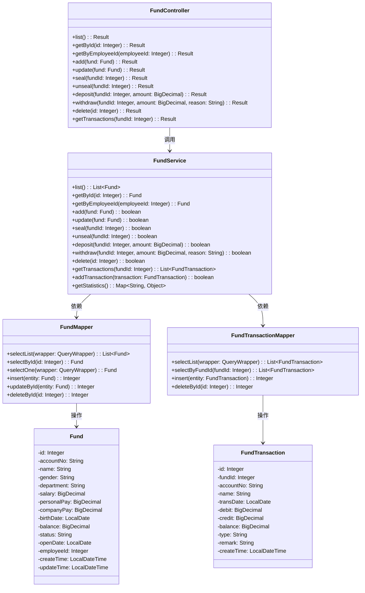

#### 3.1.10 通知公告模块类图

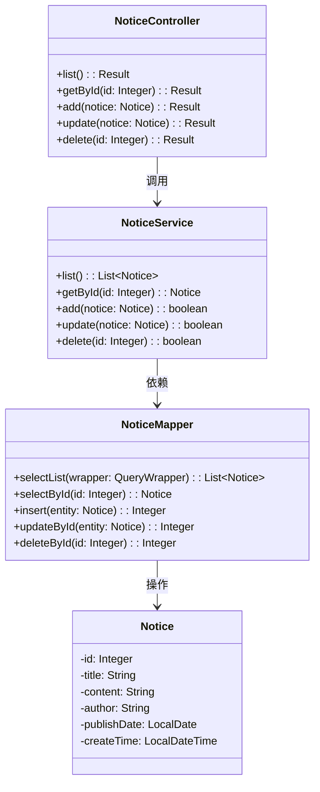

### 3.2 系统设计类列表

#### 3.2.1 实体类

##### Employee（员工实体）

| 属性名 | 数据类型 | 长度 | 默认值 | 约束 | 说明 |
| :--- | :--- | :--- | :--- | :--- | :--- |
| id | Integer | - | - | 主键，自增 | 员工ID |
| name | String | 50 | - | NOT NULL | 员工姓名 |
| department | String | 50 | - | NOT NULL | 所属部门 |
| position | String | 50 | - | NOT NULL | 职位 |
| phone | String | 20 | NULL | - | 联系电话 |
| email | String | 100 | NULL | - | 邮箱地址 |
| hireDate | LocalDate | - | NULL | - | 入职日期 |
| username | String | 50 | NULL | UNIQUE | 登录用户名 |
| password | String | 100 | NULL | - | 登录密码 |
| role | String | 20 | 'user' | - | 角色(admin/dept_admin/user) |
| createTime | LocalDateTime | - | CURRENT_TIMESTAMP | - | 创建时间 |
| updateTime | LocalDateTime | - | CURRENT_TIMESTAMP | ON UPDATE | 更新时间 |

| 操作名 | 参数 | 返回值 | 说明 |
| :--- | :--- | :--- | :--- |
| getId() | 无 | Integer | 获取员工ID |
| getName() | 无 | String | 获取员工姓名 |
| setName(String) | name: String | void | 设置员工姓名 |
| getDepartment() | 无 | String | 获取部门名称 |
| setDepartment(String) | department: String | void | 设置部门名称 |
| getRole() | 无 | String | 获取角色 |
| setRole(String) | role: String | void | 设置角色 |

##### Department（部门实体）

| 属性名 | 数据类型 | 长度 | 默认值 | 约束 | 说明 |
| :--- | :--- | :--- | :--- | :--- | :--- |
| id | Integer | - | - | 主键，自增 | 部门ID |
| name | String | 50 | - | NOT NULL, UNIQUE | 部门名称 |
| manager | String | 50 | NULL | - | 部门负责人 |
| description | String | 200 | NULL | - | 部门描述 |
| employeeCount | Integer | - | NULL | 非数据库字段 | 员工数量 |
| createTime | LocalDateTime | - | CURRENT_TIMESTAMP | - | 创建时间 |

| 操作名 | 参数 | 返回值 | 说明 |
| :--- | :--- | :--- | :--- |
| getId() | 无 | Integer | 获取部门ID |
| getName() | 无 | String | 获取部门名称 |
| getManager() | 无 | String | 获取部门负责人 |
| setManager(String) | manager: String | void | 设置部门负责人 |

##### SysUser（系统用户实体）

| 属性名 | 数据类型 | 长度 | 默认值 | 约束 | 说明 |
| :--- | :--- | :--- | :--- | :--- | :--- |
| id | Integer | - | - | 主键，自增 | 用户ID |
| username | String | 50 | - | NOT NULL | 用户名 |
| password | String | 100 | - | NOT NULL | 密码 |
| role | String | 20 | - | NOT NULL | 角色 |
| employeeId | Integer | - | NULL | - | 关联员工ID |
| createTime | LocalDateTime | - | CURRENT_TIMESTAMP | - | 创建时间 |

##### Attendance（考勤记录实体）

| 属性名 | 数据类型 | 长度 | 默认值 | 约束 | 说明 |
| :--- | :--- | :--- | :--- | :--- | :--- |
| id | Integer | - | - | 主键，自增 | 考勤ID |
| employeeId | Integer | - | - | NOT NULL | 员工ID |
| date | LocalDate | - | - | NOT NULL | 考勤日期 |
| clockIn | LocalTime | - | NULL | - | 上班打卡时间 |
| clockOut | LocalTime | - | NULL | - | 下班打卡时间 |
| status | String | 20 | 'normal' | - | 状态(normal/late/early_leave/abnormal) |
| employeeName | String | 50 | NULL | 非数据库字段 | 员工姓名 |
| createTime | LocalDateTime | - | CURRENT_TIMESTAMP | - | 创建时间 |

##### LeaveRequest（请假申请实体）

| 属性名 | 数据类型 | 长度 | 默认值 | 约束 | 说明 |
| :--- | :--- | :--- | :--- | :--- | :--- |
| id | Integer | - | - | 主键，自增 | 请假ID |
| employeeId | Integer | - | - | NOT NULL | 员工ID |
| employeeName | String | 50 | - | NOT NULL | 员工姓名 |
| type | String | 20 | - | NOT NULL | 请假类型(annual/sick/personal) |
| startDate | LocalDate | - | - | NOT NULL | 开始日期 |
| endDate | LocalDate | - | - | NOT NULL | 结束日期 |
| reason | String | 500 | NULL | - | 请假原因 |
| status | String | 20 | 'pending' | - | 状态(pending/approved/rejected) |
| createTime | LocalDateTime | - | CURRENT_TIMESTAMP | - | 创建时间 |

##### Salary（工资记录实体）

| 属性名 | 数据类型 | 长度 | 默认值 | 约束 | 说明 |
| :--- | :--- | :--- | :--- | :--- | :--- |
| id | Integer | - | - | 主键，自增 | 工资ID |
| employeeId | Integer | - | - | NOT NULL | 员工ID |
| employeeName | String | 50 | - | NOT NULL | 员工姓名 |
| month | String | 7 | - | NOT NULL | 月份(yyyy-MM) |
| baseSalary | BigDecimal | 10,2 | 0 | NOT NULL | 基本工资 |
| bonus | BigDecimal | 10,2 | 0 | NOT NULL | 奖金 |
| deduction | BigDecimal | 10,2 | 0 | NOT NULL | 扣款 |
| actualSalary | BigDecimal | 10,2 | 0 | NOT NULL | 实发工资 |
| status | String | 20 | 'pending' | - | 状态(pending/paid) |
| remark | String | 200 | NULL | - | 备注 |
| createTime | LocalDateTime | - | CURRENT_TIMESTAMP | - | 创建时间 |

##### Performance（绩效考核实体）

| 属性名 | 数据类型 | 长度 | 默认值 | 约束 | 说明 |
| :--- | :--- | :--- | :--- | :--- | :--- |
| id | Integer | - | - | 主键，自增 | 绩效ID |
| employeeId | Integer | - | - | NOT NULL | 员工ID |
| employeeName | String | 50 | - | NOT NULL | 员工姓名 |
| period | String | 20 | - | NOT NULL | 考核周期 |
| workScore | Integer | - | 0 | NOT NULL | 工作能力得分 |
| attitudeScore | Integer | - | 0 | NOT NULL | 工作态度得分 |
| teamworkScore | Integer | - | 0 | NOT NULL | 团队协作得分 |
| innovationScore | Integer | - | 0 | NOT NULL | 创新能力得分 |
| totalScore | Integer | - | 0 | NOT NULL | 综合得分 |
| level | String | 5 | 'C' | NOT NULL | 等级(A/B/C/D) |
| comment | String | 500 | NULL | - | 评语 |
| evaluator | String | 50 | NULL | - | 评估人 |
| createTime | LocalDateTime | - | CURRENT_TIMESTAMP | - | 创建时间 |

##### Training（培训实体）

| 属性名 | 数据类型 | 长度 | 默认值 | 约束 | 说明 |
| :--- | :--- | :--- | :--- | :--- | :--- |
| id | Integer | - | - | 主键，自增 | 培训ID |
| title | String | 200 | - | NOT NULL | 培训主题 |
| description | String | - | NULL | - | 培训描述 |
| trainer | String | 50 | - | NOT NULL | 讲师 |
| date | LocalDate | - | - | NOT NULL | 培训日期 |
| time | String | 50 | - | NOT NULL | 培训时间 |
| location | String | 200 | - | NOT NULL | 培训地点 |
| maxParticipants | Integer | - | 20 | NOT NULL | 人数上限 |
| participants | List\<Integer\> | - | NULL | 非数据库字段 | 参与者ID列表 |
| participantCount | Integer | - | NULL | 非数据库字段 | 参与人数 |
| createTime | LocalDateTime | - | CURRENT_TIMESTAMP | - | 创建时间 |

##### TrainingParticipant（培训报名实体）

| 属性名 | 数据类型 | 长度 | 默认值 | 约束 | 说明 |
| :--- | :--- | :--- | :--- | :--- | :--- |
| id | Integer | - | - | 主键，自增 | 报名ID |
| trainingId | Integer | - | - | NOT NULL | 培训ID |
| employeeId | Integer | - | - | NOT NULL | 员工ID |
| createTime | LocalDateTime | - | CURRENT_TIMESTAMP | - | 报名时间 |

##### Fund（公积金账户实体）

| 属性名 | 数据类型 | 长度 | 默认值 | 约束 | 说明 |
| :--- | :--- | :--- | :--- | :--- | :--- |
| id | Integer | - | - | 主键，自增 | 公积金ID |
| accountNo | String | 50 | - | NOT NULL, UNIQUE | 公积金账号 |
| name | String | 50 | - | NOT NULL | 姓名 |
| gender | String | 10 | NULL | - | 性别 |
| department | String | 50 | NULL | - | 部门 |
| salary | BigDecimal | 10,2 | 0 | - | 工资额 |
| personalPay | BigDecimal | 10,2 | 0 | - | 个人缴额 |
| companyPay | BigDecimal | 10,2 | 0 | - | 单位缴额 |
| birthDate | LocalDate | - | NULL | - | 出生日期 |
| balance | BigDecimal | 10,2 | 0 | - | 余额 |
| status | String | 20 | 'active' | NOT NULL | 状态(active/sealed/closed) |
| openDate | LocalDate | - | NULL | - | 开户日期 |
| employeeId | Integer | - | NULL | - | 关联员工ID |
| createTime | LocalDateTime | - | CURRENT_TIMESTAMP | - | 创建时间 |
| updateTime | LocalDateTime | - | CURRENT_TIMESTAMP | ON UPDATE | 更新时间 |

##### FundTransaction（公积金帐务实体）

| 属性名 | 数据类型 | 长度 | 默认值 | 约束 | 说明 |
| :--- | :--- | :--- | :--- | :--- | :--- |
| id | Integer | - | - | 主键，自增 | 帐务ID |
| fundId | Integer | - | - | NOT NULL | 公积金账户ID |
| accountNo | String | 50 | - | NOT NULL | 公积金账号 |
| name | String | 50 | - | NOT NULL | 姓名 |
| transDate | LocalDate | - | - | NOT NULL | 交易日期 |
| debit | BigDecimal | 10,2 | 0 | - | 借方（支出） |
| credit | BigDecimal | 10,2 | 0 | - | 贷方（收入） |
| balance | BigDecimal | 10,2 | 0 | - | 余额 |
| type | String | 20 | - | NOT NULL | 交易类型 |
| remark | String | 200 | NULL | - | 备注 |
| createTime | LocalDateTime | - | CURRENT_TIMESTAMP | - | 创建时间 |

##### Notice（通知公告实体）

| 属性名 | 数据类型 | 长度 | 默认值 | 约束 | 说明 |
| :--- | :--- | :--- | :--- | :--- | :--- |
| id | Integer | - | - | 主键，自增 | 通知ID |
| title | String | 200 | - | NOT NULL | 标题 |
| content | String | - | - | NOT NULL | 内容 |
| author | String | 50 | - | NOT NULL | 发布人 |
| publishDate | LocalDate | - | NULL | - | 发布日期 |
| createTime | LocalDateTime | - | CURRENT_TIMESTAMP | - | 创建时间 |

---

#### 3.2.2 业务服务类

##### EmployeeService

| 操作名 | 参数 | 返回值 | 说明 |
| :--- | :--- | :--- | :--- |
| list() | 无 | List\<Employee\> | 获取所有员工（不含超级管理员） |
| listByDepartment(String) | department: String | List\<Employee\> | 按部门获取员工列表 |
| getById(Integer) | id: Integer | Employee | 根据ID获取员工 |
| add(Employee) | employee: Employee | boolean | 添加员工 |
| update(Employee) | employee: Employee | boolean | 更新员工信息（同步部门负责人） |
| delete(Integer) | id: Integer | boolean | 删除员工 |

##### DepartmentService

| 操作名 | 参数 | 返回值 | 说明 |
| :--- | :--- | :--- | :--- |
| list() | 无 | List\<Department\> | 获取所有部门列表 |
| getById(Integer) | id: Integer | Department | 根据ID获取部门 |
| add(Department) | department: Department | boolean | 添加部门 |
| update(Department) | department: Department | boolean | 更新部门信息 |
| delete(Integer) | id: Integer | boolean | 删除部门 |

##### SysUserService

| 操作名 | 参数 | 返回值 | 说明 |
| :--- | :--- | :--- | :--- |
| login(String, String) | username: String, password: String | Result | 用户登录验证 |
| getByUsername(String) | username: String | SysUser | 根据用户名获取用户 |

##### AttendanceService

| 操作名 | 参数 | 返回值 | 说明 |
| :--- | :--- | :--- | :--- |
| listAll() | 无 | List\<Attendance\> | 获取所有考勤记录（含员工姓名） |
| getByEmployeeId(Integer) | employeeId: Integer | List\<Attendance\> | 获取员工考勤记录 |
| getTodayRecord(Integer) | employeeId: Integer | Attendance | 获取今日考勤记录 |
| clockIn(Integer) | employeeId: Integer | boolean | 上班打卡 |
| clockOut(Integer) | employeeId: Integer | boolean | 下班打卡 |
| updateStatus(Integer, String) | id: Integer, status: String | boolean | 更新考勤状态 |

##### LeaveRequestService

| 操作名 | 参数 | 返回值 | 说明 |
| :--- | :--- | :--- | :--- |
| list() | 无 | List\<LeaveRequest\> | 获取所有请假申请 |
| getByEmployeeId(Integer) | employeeId: Integer | List\<LeaveRequest\> | 获取员工请假记录 |
| apply(LeaveRequest) | request: LeaveRequest | boolean | 提交请假申请 |
| approve(Integer) | id: Integer | boolean | 批准请假 |
| reject(Integer) | id: Integer | boolean | 拒绝请假 |

##### SalaryService

| 操作名 | 参数 | 返回值 | 说明 |
| :--- | :--- | :--- | :--- |
| list() | 无 | List\<Salary\> | 获取所有工资记录 |
| getByEmployeeId(Integer) | employeeId: Integer | List\<Salary\> | 获取员工工资记录 |
| add(Salary) | salary: Salary | boolean | 添加工资记录 |
| update(Salary) | salary: Salary | boolean | 更新工资记录 |
| delete(Integer) | id: Integer | boolean | 删除工资记录 |
| calculate(Integer, String) | employeeId: Integer, month: String | BigDecimal | 计算实发工资 |

##### PerformanceService

| 操作名 | 参数 | 返回值 | 说明 |
| :--- | :--- | :--- | :--- |
| list() | 无 | List\<Performance\> | 获取所有绩效记录 |
| getByEmployeeId(Integer) | employeeId: Integer | List\<Performance\> | 获取员工绩效记录 |
| add(Performance) | performance: Performance | boolean | 添加绩效记录 |
| update(Performance) | performance: Performance | boolean | 更新绩效记录 |
| delete(Integer) | id: Integer | boolean | 删除绩效记录 |
| calculateLevel(Integer) | totalScore: Integer | String | 根据总分计算等级 |

##### TrainingService

| 操作名 | 参数 | 返回值 | 说明 |
| :--- | :--- | :--- | :--- |
| list() | 无 | List\<Training\> | 获取所有培训列表 |
| getById(Integer) | id: Integer | Training | 根据ID获取培训 |
| add(Training) | training: Training | boolean | 添加培训 |
| update(Training) | training: Training | boolean | 更新培训信息 |
| delete(Integer) | id: Integer | boolean | 删除培训 |
| register(Integer, Integer) | trainingId: Integer, employeeId: Integer | boolean | 报名培训 |
| cancel(Integer, Integer) | trainingId: Integer, employeeId: Integer | boolean | 取消报名 |

##### FundService

| 操作名 | 参数 | 返回值 | 说明 |
| :--- | :--- | :--- | :--- |
| list() | 无 | List\<Fund\> | 获取所有公积金账户 |
| getById(Integer) | id: Integer | Fund | 根据ID获取账户 |
| getByEmployeeId(Integer) | employeeId: Integer | Fund | 根据员工ID获取账户 |
| add(Fund) | fund: Fund | boolean | 添加公积金账户 |
| update(Fund) | fund: Fund | boolean | 更新账户信息 |
| delete(Integer) | id: Integer | boolean | 删除账户 |
| deposit(Integer, BigDecimal) | fundId: Integer, amount: BigDecimal | boolean | 缴存公积金 |
| withdraw(Integer, BigDecimal, String) | fundId: Integer, amount: BigDecimal, reason: String | boolean | 提取公积金 |
| seal(Integer) | fundId: Integer | boolean | 封存账户 |
| unseal(Integer) | fundId: Integer | boolean | 解封账户 |

##### NoticeService

| 操作名 | 参数 | 返回值 | 说明 |
| :--- | :--- | :--- | :--- |
| list() | 无 | List\<Notice\> | 获取所有通知公告 |
| getById(Integer) | id: Integer | Notice | 根据ID获取通知 |
| add(Notice) | notice: Notice | boolean | 添加通知 |
| update(Notice) | notice: Notice | boolean | 更新通知 |
| delete(Integer) | id: Integer | boolean | 删除通知 |

---

#### 3.2.3 控制类

##### AuthController

| 操作名 | 参数 | 返回值 | 说明 |
| :--- | :--- | :--- | :--- |
| login(String, String) | username: String, password: String | Result | 用户登录 |
| getUserInfo() | 无 | Result | 获取当前用户信息 |

##### EmployeeController

| 操作名 | 参数 | 返回值 | 说明 |
| :--- | :--- | :--- | :--- |
| getList() | 无 | Result | 获取员工列表 |
| getById(Integer) | id: Integer | Result | 根据ID获取员工 |
| addEmp(Employee) | employee: Employee | Result | 添加员工 |
| updateEmp(Employee) | employee: Employee | Result | 更新员工 |
| deleteEmp(Integer) | id: Integer | Result | 删除员工 |

##### DepartmentController

| 操作名 | 参数 | 返回值 | 说明 |
| :--- | :--- | :--- | :--- |
| getList() | 无 | Result | 获取部门列表 |
| getById(Integer) | id: Integer | Result | 根据ID获取部门 |
| addDept(Department) | department: Department | Result | 添加部门 |
| updateDept(Department) | department: Department | Result | 更新部门 |
| deleteDept(Integer) | id: Integer | Result | 删除部门 |

##### AttendanceController

| 操作名 | 参数 | 返回值 | 说明 |
| :--- | :--- | :--- | :--- |
| getList() | 无 | Result | 获取所有考勤记录 |
| getByEmployeeId(Integer) | employeeId: Integer | Result | 获取员工考勤记录 |
| clockIn(Integer) | employeeId: Integer | Result | 上班打卡 |
| clockOut(Integer) | employeeId: Integer | Result | 下班打卡 |
| updateStatus(Integer, String) | id: Integer, status: String | Result | 更新考勤状态 |

##### LeaveController

| 操作名 | 参数 | 返回值 | 说明 |
| :--- | :--- | :--- | :--- |
| getList() | 无 | Result | 获取请假申请列表 |
| getByEmployeeId(Integer) | employeeId: Integer | Result | 获取员工请假记录 |
| apply(LeaveRequest) | request: LeaveRequest | Result | 提交请假申请 |
| approve(Integer) | id: Integer | Result | 批准请假 |
| reject(Integer) | id: Integer | Result | 拒绝请假 |

##### SalaryController

| 操作名 | 参数 | 返回值 | 说明 |
| :--- | :--- | :--- | :--- |
| getList() | 无 | Result | 获取工资记录列表 |
| getByEmployeeId(Integer) | employeeId: Integer | Result | 获取员工工资记录 |
| addSalary(Salary) | salary: Salary | Result | 添加工资记录 |
| updateSalary(Salary) | salary: Salary | Result | 更新工资记录 |
| deleteSalary(Integer) | id: Integer | Result | 删除工资记录 |

##### PerformanceController

| 操作名 | 参数 | 返回值 | 说明 |
| :--- | :--- | :--- | :--- |
| getList() | 无 | Result | 获取绩效记录列表 |
| getByEmployeeId(Integer) | employeeId: Integer | Result | 获取员工绩效记录 |
| addPerformance(Performance) | performance: Performance | Result | 添加绩效记录 |
| updatePerformance(Performance) | performance: Performance | Result | 更新绩效记录 |
| deletePerformance(Integer) | id: Integer | Result | 删除绩效记录 |

##### TrainingController

| 操作名 | 参数 | 返回值 | 说明 |
| :--- | :--- | :--- | :--- |
| getList() | 无 | Result | 获取培训列表 |
| getById(Integer) | id: Integer | Result | 根据ID获取培训 |
| addTraining(Training) | training: Training | Result | 添加培训 |
| updateTraining(Training) | training: Training | Result | 更新培训信息 |
| deleteTraining(Integer) | id: Integer | Result | 删除培训 |
| register(Integer) | trainingId: Integer | Result | 报名培训 |
| cancel(Integer) | trainingId: Integer | Result | 取消报名 |

##### FundController

| 操作名 | 参数 | 返回值 | 说明 |
| :--- | :--- | :--- | :--- |
| getList() | 无 | Result | 获取公积金账户列表 |
| getById(Integer) | id: Integer | Result | 根据ID获取账户 |
| getByEmployeeId(Integer) | employeeId: Integer | Result | 根据员工ID获取账户 |
| addFund(Fund) | fund: Fund | Result | 添加公积金账户 |
| updateFund(Fund) | fund: Fund | Result | 更新账户信息 |
| deleteFund(Integer) | id: Integer | Result | 删除账户 |
| deposit(Integer, BigDecimal) | fundId: Integer, amount: BigDecimal | Result | 缴存公积金 |
| withdraw(Integer, BigDecimal, String) | fundId: Integer, amount: BigDecimal, reason: String | Result | 提取公积金 |
| seal(Integer) | fundId: Integer | Result | 封存账户 |
| unseal(Integer) | fundId: Integer | Result | 解封账户 |

##### NoticeController

| 操作名 | 参数 | 返回值 | 说明 |
| :--- | :--- | :--- | :--- |
| getList() | 无 | Result | 获取通知公告列表 |
| getById(Integer) | id: Integer | Result | 根据ID获取通知 |
| addNotice(Notice) | notice: Notice | Result | 添加通知 |
| updateNotice(Notice) | notice: Notice | Result | 更新通知 |
| deleteNotice(Integer) | id: Integer | Result | 删除通知 |

---

## 4. 业务服务动态建模

### 4.1 用户登录时序图

```
参与者          界面类(边界类)        控制类              业务服务类          实体类
  │                 │                  │                    │                   │
  │  输入用户名密码   │                  │                    │                   │
  │────────────────►│                  │                    │                   │
  │                 │   POST /auth/login│                    │                   │
  │                 │──────────────────►│                    │                   │
  │                 │                  │   login(username,   │                   │
  │                 │                  │           password) │                   │
  │                 │                  │────────────────────►│                   │
  │                 │                  │                    │   查询SysUser     │
  │                 │                  │                    │───────────────────►│
  │                 │                  │                    │   返回SysUser     │
  │                 │                  │                    │◄───────────────────│
  │                 │                  │                    │  验证密码         │
  │                 │                  │   返回Result       │                   │
  │                 │                  │◄────────────────────│                   │
  │                 │  返回登录结果     │                    │                   │
  │                 │◄──────────────────│                    │                   │
  │  显示登录结果     │                  │                    │                   │
  │◄────────────────│                  │                    │                   │
  │                 │                  │                    │                   │
```

### 4.2 上班打卡时序图

```
参与者          界面类(边界类)        控制类              业务服务类          实体类
  │                 │                  │                    │                   │
  │  点击打卡按钮     │                  │                    │                   │
  │────────────────►│                  │                    │                   │
  │                 │  POST /attendance/clockIn │          │                   │
  │                 │─────────────────────────►│          │                   │
  │                 │                  │   clockIn(empId)   │                   │
  │                 │                  │───────────────────►│                   │
  │                 │                  │                    │ getTodayRecord()  │
  │                 │                  │                    │───────────────────►│
  │                 │                  │                    │ 返回今日记录      │
  │                 │                  │                    │◄───────────────────│
  │                 │                  │                    │ 判断是否已打卡     │
  │                 │                  │                    │ 创建Attendance    │
  │                 │                  │                    │───────────────────►│
  │                 │                  │                    │ 保存到数据库      │
  │                 │                  │   返回boolean      │                   │
  │                 │                  │◄───────────────────│                   │
  │                 │  返回打卡结果     │                    │                   │
  │                 │◄─────────────────────────│          │                   │
  │  显示打卡时间     │                  │                    │                   │
  │◄────────────────│                  │                    │                   │
  │                 │                  │                    │                   │
```

### 4.3 提交请假申请时序图

```
参与者          界面类(边界类)        控制类              业务服务类          实体类
  │                 │                  │                    │                   │
  │  填写请假表单     │                  │                    │                   │
  │────────────────►│                  │                    │                   │
  │                 │  POST /leave/apply │                   │                   │
  │                 │───────────────────►│                   │                   │
  │                 │                  │   apply(request)    │                   │
  │                 │                  │────────────────────►│                   │
  │                 │                  │                    │ 创建LeaveRequest  │
  │                 │                  │                    │ 设置status=pending│
  │                 │                  │                    │───────────────────►│
  │                 │                  │                    │ 保存到数据库      │
  │                 │                  │   返回boolean      │                   │
  │                 │                  │◄────────────────────│                   │
  │                 │  返回申请结果     │                    │                   │
  │                 │◄───────────────────│                   │                   │
  │  显示申请结果     │                  │                    │                   │
  │◄────────────────│                  │                    │                   │
  │                 │                  │                    │                   │
```

### 4.4 审批请假申请时序图

```
参与者          界面类(边界类)        控制类              业务服务类          实体类
  │                 │                  │                    │                   │
  │  选择审批操作     │                  │                    │                   │
  │────────────────►│                  │                    │                   │
  │                 │  PUT /leave/approve/{id} │           │                   │
  │                 │─────────────────────────►│           │                   │
  │                 │                  │   approve(id)      │                   │
  │                 │                  │───────────────────►│                   │
  │                 │                  │                    │ 查询LeaveRequest │
  │                 │                  │                    │───────────────────►│
  │                 │                  │                    │ 返回LeaveRequest │
  │                 │                  │                    │◄───────────────────│
  │                 │                  │                    │ 设置status=approved│
  │                 │                  │                    │ 更新到数据库      │
  │                 │                  │                    │───────────────────►│
  │                 │                  │   返回boolean      │                   │
  │                 │                  │◄───────────────────│                   │
  │                 │  返回审批结果     │                    │                   │
  │                 │◄─────────────────────────│           │                   │
  │  显示审批结果     │                  │                    │                   │
  │◄────────────────│                  │                    │                   │
  │                 │                  │                    │                   │
```

### 4.5 报名培训时序图

```
参与者          界面类(边界类)        控制类              业务服务类          实体类
  │                 │                  │                    │                   │
  │  选择培训报名     │                  │                    │                   │
  │────────────────►│                  │                    │                   │
  │                 │  POST /training/register/{id} │       │                   │
  │                 │─────────────────────────────►│       │                   │
  │                 │                  │   register(trId,   │                   │
  │                 │                  │              empId)│                   │
  │                 │                  │───────────────────►│                   │
  │                 │                  │                    │ 查询Training     │
  │                 │                  │                    │───────────────────►│
  │                 │                  │                    │ 返回Training     │
  │                 │                  │                    │◄───────────────────│
  │                 │                  │                    │ 判断人数是否已满  │
  │                 │                  │                    │ 创建TrainingParti-│
  │                 │                  │                    │   cipant         │
  │                 │                  │                    │───────────────────►│
  │                 │                  │                    │ 保存到数据库      │
  │                 │                  │   返回boolean      │                   │
  │                 │                  │◄───────────────────│                   │
  │                 │  返回报名结果     │                    │                   │
  │                 │◄─────────────────────────────│       │                   │
  │  显示报名结果     │                  │                    │                   │
  │◄────────────────│                  │                    │                   │
  │                 │                  │                    │                   │
```

### 4.6 公积金缴存时序图

```
参与者          界面类(边界类)        控制类              业务服务类          实体类
  │                 │                  │                    │                   │
  │  输入缴存金额     │                  │                    │                   │
  │────────────────►│                  │                    │                   │
  │                 │  POST /fund/deposit │                  │                   │
  │                 │───────────────────►│                  │                   │
  │                 │                  │   deposit(fundId,  │                   │
  │                 │                  │           amount)  │                   │
  │                 │                  │───────────────────►│                   │
  │                 │                  │                    │ 查询Fund         │
  │                 │                  │                    │───────────────────►│
  │                 │                  │                    │ 返回Fund         │
  │                 │                  │                    │◄───────────────────│
  │                 │                  │                    │ 更新余额         │
  │                 │                  │                    │ 创建FundTransac- │
  │                 │                  │                    │   tion           │
  │                 │                  │                    │───────────────────►│
  │                 │                  │                    │ 保存到数据库      │
  │                 │                  │   返回boolean      │                   │
  │                 │                  │◄───────────────────│                   │
  │                 │  返回缴存结果     │                    │                   │
  │                 │◄───────────────────│                  │                   │
  │  显示缴存结果     │                  │                    │                   │
  │◄────────────────│                  │                    │                   │
  │                 │                  │                    │                   │
```

---

## 5. 数据库设计

### 5.1 数据库表结构

#### 5.1.1 department（部门表）

| 字段名 | 类型 | 长度 | 可空 | 默认值 | 主键 | 说明 |
| :--- | :--- | :--- | :--- | :--- | :--- | :--- |
| id | INT | - | NO | - | YES | 部门ID |
| name | VARCHAR | 50 | NO | - | NO | 部门名称 |
| manager | VARCHAR | 50 | YES | NULL | NO | 部门负责人 |
| description | VARCHAR | 200 | YES | NULL | NO | 部门描述 |
| create_time | DATETIME | - | YES | CURRENT_TIMESTAMP | NO | 创建时间 |

**索引：**
- 主键索引：`PRIMARY KEY (id)`
- 唯一索引：`UNIQUE KEY uk_name (name)`

#### 5.1.2 employee（员工表）

| 字段名 | 类型 | 长度 | 可空 | 默认值 | 主键 | 说明 |
| :--- | :--- | :--- | :--- | :--- | :--- | :--- |
| id | INT | - | NO | - | YES | 员工ID |
| name | VARCHAR | 50 | NO | - | NO | 姓名 |
| department | VARCHAR | 50 | NO | - | NO | 部门 |
| position | VARCHAR | 50 | NO | - | NO | 职位 |
| phone | VARCHAR | 20 | YES | NULL | NO | 电话 |
| email | VARCHAR | 100 | YES | NULL | NO | 邮箱 |
| hire_date | DATE | - | YES | NULL | NO | 入职日期 |
| username | VARCHAR | 50 | YES | NULL | NO | 登录用户名 |
| password | VARCHAR | 100 | YES | NULL | NO | 登录密码 |
| role | VARCHAR | 20 | YES | 'user' | NO | 角色 |
| create_time | DATETIME | - | YES | CURRENT_TIMESTAMP | NO | 创建时间 |
| update_time | DATETIME | - | YES | CURRENT_TIMESTAMP | NO | 更新时间 |

**索引：**
- 主键索引：`PRIMARY KEY (id)`
- 唯一索引：`UNIQUE KEY uk_username (username)`

#### 5.1.3 sys_user（系统用户表）

| 字段名 | 类型 | 长度 | 可空 | 默认值 | 主键 | 说明 |
| :--- | :--- | :--- | :--- | :--- | :--- | :--- |
| id | INT | - | NO | - | YES | 用户ID |
| username | VARCHAR | 50 | NO | - | NO | 用户名 |
| password | VARCHAR | 100 | NO | - | NO | 密码 |
| role | VARCHAR | 20 | NO | - | NO | 角色 |
| employee_id | INT | - | YES | NULL | NO | 关联员工ID |
| create_time | DATETIME | - | YES | CURRENT_TIMESTAMP | NO | 创建时间 |

**索引：**
- 主键索引：`PRIMARY KEY (id)`
- 外键索引：`KEY idx_employee_id (employee_id)`

#### 5.1.4 attendance（考勤记录表）

| 字段名 | 类型 | 长度 | 可空 | 默认值 | 主键 | 说明 |
| :--- | :--- | :--- | :--- | :--- | :--- | :--- |
| id | INT | - | NO | - | YES | 考勤ID |
| employee_id | INT | - | NO | - | NO | 员工ID |
| date | DATE | - | NO | - | NO | 日期 |
| clock_in | TIME | - | YES | NULL | NO | 上班打卡时间 |
| clock_out | TIME | - | YES | NULL | NO | 下班打卡时间 |
| status | VARCHAR | 20 | YES | 'normal' | NO | 考勤状态 |
| create_time | DATETIME | - | YES | CURRENT_TIMESTAMP | NO | 创建时间 |

**索引：**
- 主键索引：`PRIMARY KEY (id)`
- 唯一索引：`UNIQUE KEY uk_employee_date (employee_id, date)`

#### 5.1.5 leave_request（请假申请表）

| 字段名 | 类型 | 长度 | 可空 | 默认值 | 主键 | 说明 |
| :--- | :--- | :--- | :--- | :--- | :--- | :--- |
| id | INT | - | NO | - | YES | 请假ID |
| employee_id | INT | - | NO | - | NO | 员工ID |
| employee_name | VARCHAR | 50 | NO | - | NO | 员工姓名 |
| type | VARCHAR | 20 | NO | - | NO | 请假类型 |
| start_date | DATE | - | NO | - | NO | 开始日期 |
| end_date | DATE | - | NO | - | NO | 结束日期 |
| reason | VARCHAR | 500 | YES | NULL | NO | 请假原因 |
| status | VARCHAR | 20 | NO | 'pending' | NO | 状态 |
| create_time | DATETIME | - | YES | CURRENT_TIMESTAMP | NO | 创建时间 |

**索引：**
- 主键索引：`PRIMARY KEY (id)`
- 外键索引：`KEY idx_employee_id (employee_id)`

#### 5.1.6 salary（工资记录表）

| 字段名 | 类型 | 长度 | 可空 | 默认值 | 主键 | 说明 |
| :--- | :--- | :--- | :--- | :--- | :--- | :--- |
| id | INT | - | NO | - | YES | 工资ID |
| employee_id | INT | - | NO | - | NO | 员工ID |
| employee_name | VARCHAR | 50 | NO | - | NO | 员工姓名 |
| month | VARCHAR | 7 | NO | - | NO | 月份 |
| base_salary | DECIMAL | 10,2 | NO | 0 | NO | 基本工资 |
| bonus | DECIMAL | 10,2 | NO | 0 | NO | 奖金 |
| deduction | DECIMAL | 10,2 | NO | 0 | NO | 扣款 |
| actual_salary | DECIMAL | 10,2 | NO | 0 | NO | 实发工资 |
| status | VARCHAR | 20 | NO | 'pending' | NO | 状态 |
| remark | VARCHAR | 200 | YES | NULL | NO | 备注 |
| create_time | DATETIME | - | YES | CURRENT_TIMESTAMP | NO | 创建时间 |

**索引：**
- 主键索引：`PRIMARY KEY (id)`
- 外键索引：`KEY idx_employee_id (employee_id)`

#### 5.1.7 performance（绩效考核表）

| 字段名 | 类型 | 长度 | 可空 | 默认值 | 主键 | 说明 |
| :--- | :--- | :--- | :--- | :--- | :--- | :--- |
| id | INT | - | NO | - | YES | 绩效ID |
| employee_id | INT | - | NO | - | NO | 员工ID |
| employee_name | VARCHAR | 50 | NO | - | NO | 员工姓名 |
| period | VARCHAR | 20 | NO | - | NO | 考核周期 |
| work_score | INT | - | NO | 0 | NO | 工作能力得分 |
| attitude_score | INT | - | NO | 0 | NO | 工作态度得分 |
| teamwork_score | INT | - | NO | 0 | NO | 团队协作得分 |
| innovation_score | INT | - | NO | 0 | NO | 创新能力得分 |
| total_score | INT | - | NO | 0 | NO | 综合得分 |
| level | VARCHAR | 5 | NO | 'C' | NO | 等级 |
| comment | VARCHAR | 500 | YES | NULL | NO | 评语 |
| evaluator | VARCHAR | 50 | YES | NULL | NO | 评估人 |
| create_time | DATETIME | - | YES | CURRENT_TIMESTAMP | NO | 创建时间 |

**索引：**
- 主键索引：`PRIMARY KEY (id)`
- 外键索引：`KEY idx_employee_id (employee_id)`

#### 5.1.8 training（培训表）

| 字段名 | 类型 | 长度 | 可空 | 默认值 | 主键 | 说明 |
| :--- | :--- | :--- | :--- | :--- | :--- | :--- |
| id | INT | - | NO | - | YES | 培训ID |
| title | VARCHAR | 200 | NO | - | NO | 培训主题 |
| description | TEXT | - | YES | NULL | NO | 培训描述 |
| trainer | VARCHAR | 50 | NO | - | NO | 讲师 |
| date | DATE | - | NO | - | NO | 培训日期 |
| time | VARCHAR | 50 | NO | - | NO | 培训时间 |
| location | VARCHAR | 200 | NO | - | NO | 培训地点 |
| max_participants | INT | - | NO | 20 | NO | 人数上限 |
| create_time | DATETIME | - | YES | CURRENT_TIMESTAMP | NO | 创建时间 |

**索引：**
- 主键索引：`PRIMARY KEY (id)`

#### 5.1.9 training_participant（培训报名表）

| 字段名 | 类型 | 长度 | 可空 | 默认值 | 主键 | 说明 |
| :--- | :--- | :--- | :--- | :--- | :--- | :--- |
| id | INT | - | NO | - | YES | 报名ID |
| training_id | INT | - | NO | - | NO | 培训ID |
| employee_id | INT | - | NO | - | NO | 员工ID |
| create_time | DATETIME | - | YES | CURRENT_TIMESTAMP | NO | 报名时间 |

**索引：**
- 主键索引：`PRIMARY KEY (id)`
- 唯一索引：`UNIQUE KEY uk_training_employee (training_id, employee_id)`
- 外键索引：`KEY idx_training_id (training_id)`
- 外键索引：`KEY idx_employee_id (employee_id)`

#### 5.1.10 fund（公积金账户表）

| 字段名 | 类型 | 长度 | 可空 | 默认值 | 主键 | 说明 |
| :--- | :--- | :--- | :--- | :--- | :--- | :--- |
| id | INT | - | NO | - | YES | 公积金ID |
| account_no | VARCHAR | 50 | NO | - | NO | 公积金账号 |
| name | VARCHAR | 50 | NO | - | NO | 姓名 |
| gender | VARCHAR | 10 | YES | NULL | NO | 性别 |
| department | VARCHAR | 50 | YES | NULL | NO | 部门 |
| salary | DECIMAL | 10,2 | YES | 0 | NO | 工资额 |
| personal_pay | DECIMAL | 10,2 | YES | 0 | NO | 个人缴额 |
| company_pay | DECIMAL | 10,2 | YES | 0 | NO | 单位缴额 |
| birth_date | DATE | - | YES | NULL | NO | 出生日期 |
| balance | DECIMAL | 10,2 | YES | 0 | NO | 余额 |
| status | VARCHAR | 20 | NO | 'active' | NO | 状态 |
| open_date | DATE | - | YES | NULL | NO | 开户日期 |
| employee_id | INT | - | YES | NULL | NO | 关联员工ID |
| create_time | DATETIME | - | YES | CURRENT_TIMESTAMP | NO | 创建时间 |
| update_time | DATETIME | - | YES | CURRENT_TIMESTAMP | NO | 更新时间 |

**索引：**
- 主键索引：`PRIMARY KEY (id)`
- 唯一索引：`UNIQUE KEY uk_account_no (account_no)`
- 外键索引：`KEY idx_employee_id (employee_id)`

#### 5.1.11 fund_transaction（公积金帐务表）

| 字段名 | 类型 | 长度 | 可空 | 默认值 | 主键 | 说明 |
| :--- | :--- | :--- | :--- | :--- | :--- | :--- |
| id | INT | - | NO | - | YES | 帐务ID |
| fund_id | INT | - | NO | - | NO | 公积金账户ID |
| account_no | VARCHAR | 50 | NO | - | NO | 公积金账号 |
| name | VARCHAR | 50 | NO | - | NO | 姓名 |
| trans_date | DATE | - | NO | - | NO | 交易日期 |
| debit | DECIMAL | 10,2 | YES | 0 | NO | 借方（支出） |
| credit | DECIMAL | 10,2 | YES | 0 | NO | 贷方（收入） |
| balance | DECIMAL | 10,2 | YES | 0 | NO | 余额 |
| type | VARCHAR | 20 | NO | - | NO | 交易类型 |
| remark | VARCHAR | 200 | YES | NULL | NO | 备注 |
| create_time | DATETIME | - | YES | CURRENT_TIMESTAMP | NO | 创建时间 |

**索引：**
- 主键索引：`PRIMARY KEY (id)`
- 外键索引：`KEY idx_fund_id (fund_id)`
- 外键索引：`KEY idx_trans_date (trans_date)`

#### 5.1.12 notice（通知公告表）

| 字段名 | 类型 | 长度 | 可空 | 默认值 | 主键 | 说明 |
| :--- | :--- | :--- | :--- | :--- | :--- | :--- |
| id | INT | - | NO | - | YES | 通知ID |
| title | VARCHAR | 200 | NO | - | NO | 标题 |
| content | TEXT | - | NO | - | NO | 内容 |
| author | VARCHAR | 50 | NO | - | NO | 发布人 |
| publish_date | DATE | - | YES | NULL | NO | 发布日期 |
| create_time | DATETIME | - | YES | CURRENT_TIMESTAMP | NO | 创建时间 |

**索引：**
- 主键索引：`PRIMARY KEY (id)`

---

### 5.2 表关系图

```
department ──────┬─── employee ──────┬─── attendance
    │            │         │          │
    │            │         │          ├─── leave_request
    │            │         │          ├─── salary
    │            │         │          ├─── performance
    │            │         │          │
    │            │         │          ├─── training_participant ─── training
    │            │         │          │
    │            │         └──────────┴─── fund ─── fund_transaction
    │            │
    └────────────┴─── sys_user
```

**关联关系说明：**
- `department` 与 `employee`：一对多（一个部门包含多个员工）
- `employee` 与 `sys_user`：一对一（一个员工对应一个系统用户）
- `employee` 与 `attendance`：一对多（一个员工有多条考勤记录）
- `employee` 与 `leave_request`：一对多（一个员工有多条请假记录）
- `employee` 与 `salary`：一对多（一个员工有多条工资记录）
- `employee` 与 `performance`：一对多（一个员工有多条绩效记录）
- `employee` 与 `training_participant`：一对多（一个员工可报名多个培训）
- `employee` 与 `fund`：一对一（一个员工对应一个公积金账户）
- `training` 与 `training_participant`：一对多（一个培训有多个报名者）
- `fund` 与 `fund_transaction`：一对多（一个公积金账户有多条帐务记录）