# 人力资源管理系统 - 技术解决方案

---

## 2. 技术解决方案

### 2.1 软件架构设计

#### 2.1.1 架构风格

本系统采用 **分层架构（Layered Architecture）** 与 **MVC设计模式** 相结合的架构风格。系统分为表示层、业务逻辑层和数据访问层三个主要层次，各层职责清晰，便于维护和扩展。

**架构特点：**
- **高内聚低耦合**：各层之间通过接口交互，降低依赖关系
- **可扩展性**：支持业务功能的水平扩展和垂直扩展
- **可维护性**：分层设计使代码易于理解和维护

#### 2.1.2 技术框架

| 层次 | 技术选型 | 版本 |
| :--- | :--- | :--- |
| **前端框架** | Vue.js | 3.x |
| **前端构建工具** | Vite | 5.x |
| **状态管理** | Pinia | 2.x |
| **UI组件库** | Element Plus | 2.x |
| **后端框架** | Spring Boot | 3.x |
| **持久层框架** | MyBatis Plus | 3.5.x |
| **数据库** | MySQL | 8.0+ |
| **连接池** | HikariCP | 5.x |

#### 2.1.3 设计模式

| 设计模式 | 应用场景 |
| :--- | :--- |
| **MVC模式** | 前端Vue组件与后端Controller分离 |
| **单例模式** | Spring Bean管理 |
| **策略模式** | 考勤状态判断、绩效等级计算 |
| **模板方法模式** | Service层通用CRUD操作 |
| **DAO模式** | Mapper接口与MyBatis Plus集成 |

#### 2.1.4 架构示意图（简约版）

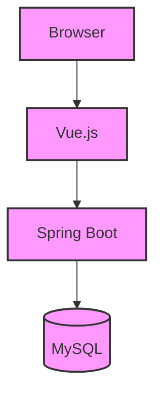

#### 2.1.5 架构示意图（详细版）

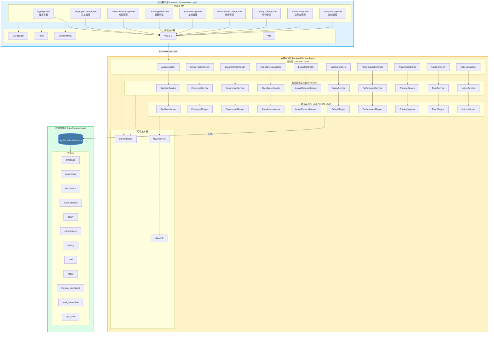

---

### 2.2 开发平台描述

#### 2.2.1 硬件环境

| 类别 | 要求 |
| :--- | :--- |
| **服务器** | CPU: Intel Xeon E5-2620 v4 及以上<br>内存: 16GB 及以上<br>硬盘: SSD 200GB 及以上 |
| **开发机** | CPU: Intel Core i5-8400 及以上<br>内存: 8GB 及以上<br>硬盘: SSD 100GB 及以上 |
| **网络** | 局域网/互联网，带宽 10Mbps 及以上 |

#### 2.2.2 支持环境

| 类别 | 软件 | 版本 |
| :--- | :--- | :--- |
| **操作系统** | Windows Server | 2019/2022 |
| **数据库** | MySQL | 8.0+ |
| **Web服务器** | Nginx | 1.20+ |
| **JDK** | OpenJDK | 21 |
| **Node.js** | Node.js | 20.x |
| **包管理** | npm/pnpm | 10.x/9.x |

#### 2.2.3 开发语言

| 层次 | 语言 | 说明 |
| :--- | :--- | :--- |
| **前端** | JavaScript (ES6+) | Vue.js 3 组件开发 |
| **后端** | Java | Spring Boot 服务端开发 |
| **数据库** | SQL | MySQL 数据操作 |

---

## 3. 系统设计类建模

### 3.1 系统设计类图

#### 3.1.1 用户认证模块类图

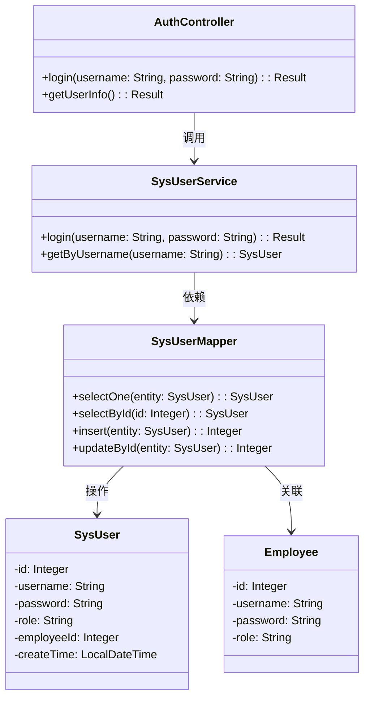

#### 3.1.2 员工管理模块类图

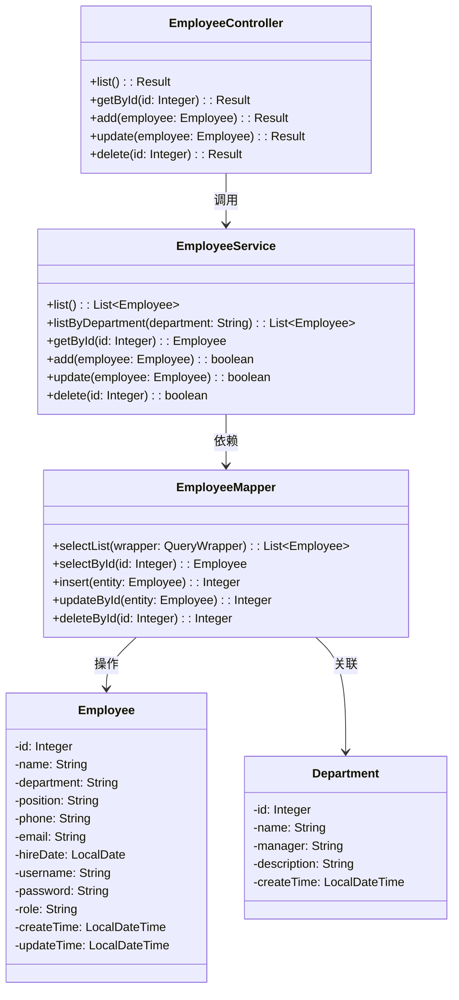

#### 3.1.3 部门管理模块类图

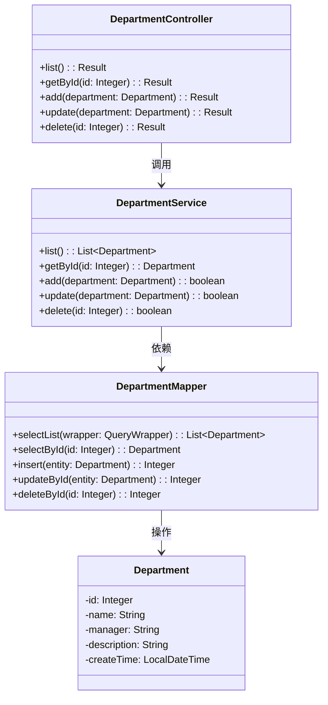

#### 3.1.4 考勤管理模块类图

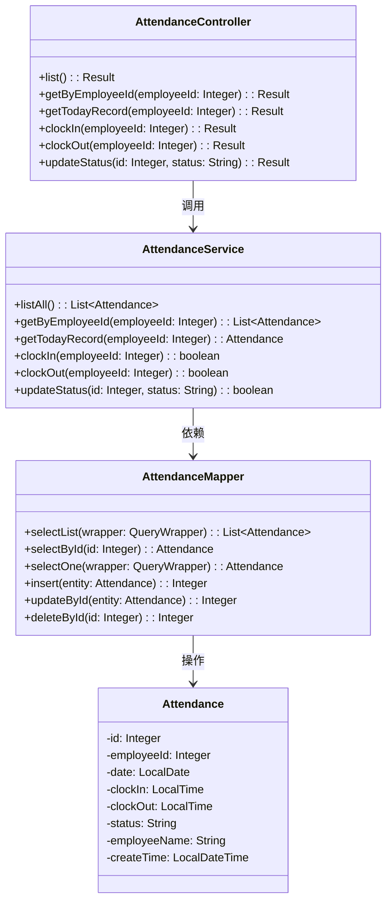

#### 3.1.5 请假管理模块类图

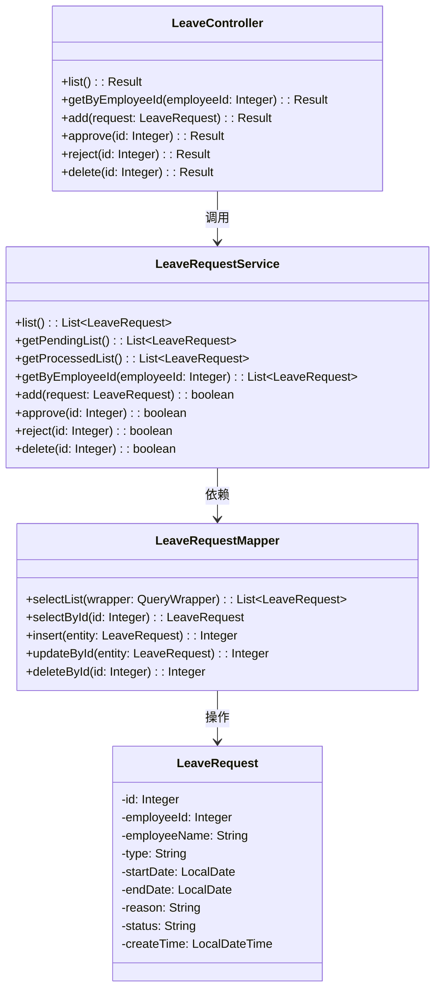

#### 3.1.6 工资管理模块类图

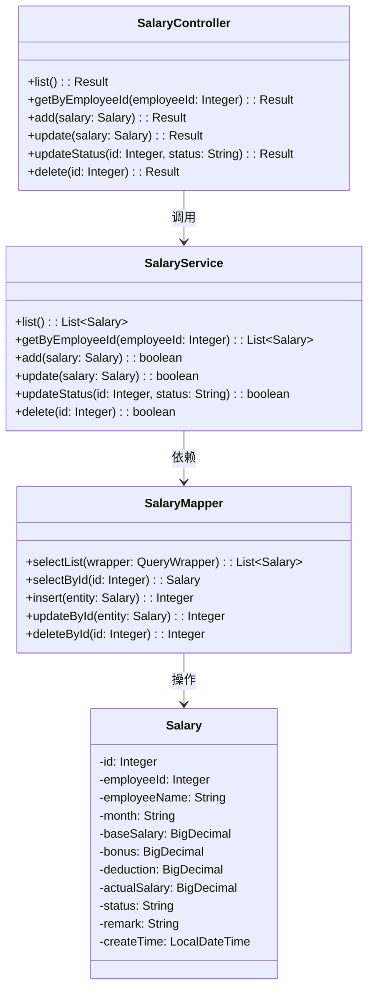

#### 3.1.7 绩效考核模块类图

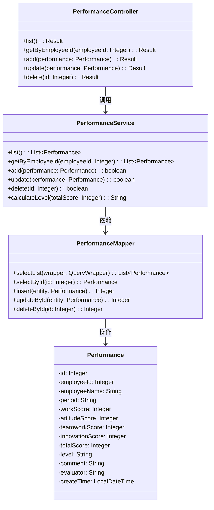

#### 3.1.8 培训管理模块类图

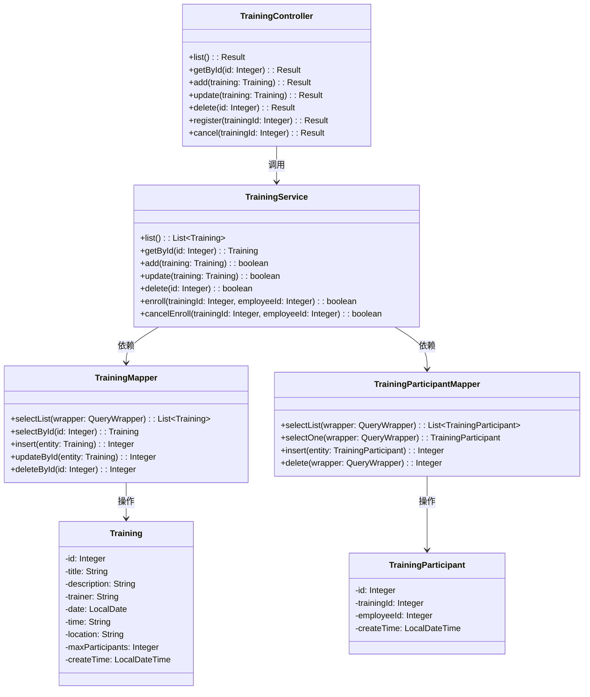

#### 3.1.9 公积金管理模块类图

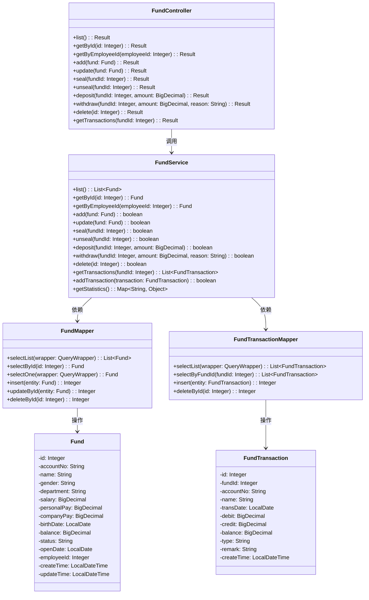

#### 3.1.10 通知公告模块类图

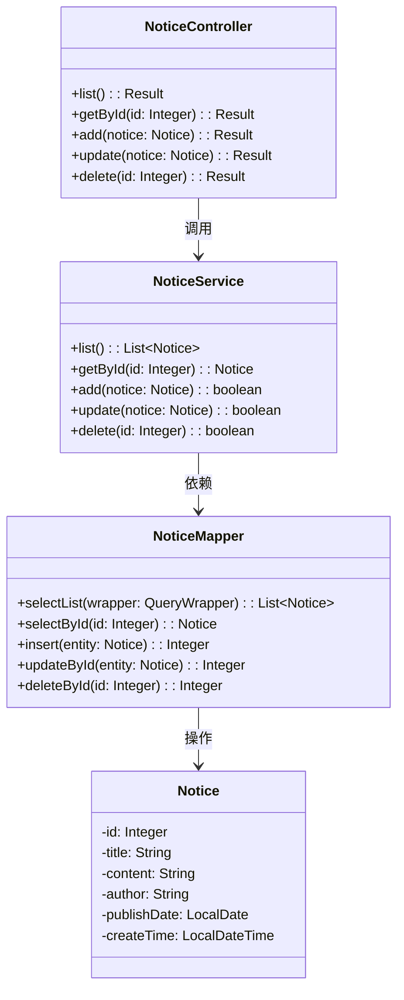

### 3.2 系统设计类列表

#### 3.2.1 实体类

##### Employee（员工实体）

| 属性名 | 数据类型 | 长度 | 默认值 | 约束 | 说明 |
| :--- | :--- | :--- | :--- | :--- | :--- |
| id | Integer | - | - | 主键，自增 | 员工ID |
| name | String | 50 | - | NOT NULL | 员工姓名 |
| department | String | 50 | - | NOT NULL | 所属部门 |
| position | String | 50 | - | NOT NULL | 职位 |
| phone | String | 20 | NULL | - | 联系电话 |
| email | String | 100 | NULL | - | 邮箱地址 |
| hireDate | LocalDate | - | NULL | - | 入职日期 |
| username | String | 50 | NULL | UNIQUE | 登录用户名 |
| password | String | 100 | NULL | - | 登录密码 |
| role | String | 20 | 'user' | - | 角色(admin/dept_admin/user) |
| createTime | LocalDateTime | - | CURRENT_TIMESTAMP | - | 创建时间 |
| updateTime | LocalDateTime | - | CURRENT_TIMESTAMP | ON UPDATE | 更新时间 |

| 操作名 | 参数 | 返回值 | 说明 |
| :--- | :--- | :--- | :--- |
| getId() | 无 | Integer | 获取员工ID |
| getName() | 无 | String | 获取员工姓名 |
| setName(String) | name: String | void | 设置员工姓名 |
| getDepartment() | 无 | String | 获取部门名称 |
| setDepartment(String) | department: String | void | 设置部门名称 |
| getRole() | 无 | String | 获取角色 |
| setRole(String) | role: String | void | 设置角色 |

##### Department（部门实体）

| 属性名 | 数据类型 | 长度 | 默认值 | 约束 | 说明 |
| :--- | :--- | :--- | :--- | :--- | :--- |
| id | Integer | - | - | 主键，自增 | 部门ID |
| name | String | 50 | - | NOT NULL, UNIQUE | 部门名称 |
| manager | String | 50 | NULL | - | 部门负责人 |
| description | String | 200 | NULL | - | 部门描述 |
| employeeCount | Integer | - | NULL | 非数据库字段 | 员工数量 |
| createTime | LocalDateTime | - | CURRENT_TIMESTAMP | - | 创建时间 |

| 操作名 | 参数 | 返回值 | 说明 |
| :--- | :--- | :--- | :--- |
| getId() | 无 | Integer | 获取部门ID |
| getName() | 无 | String | 获取部门名称 |
| getManager() | 无 | String | 获取部门负责人 |
| setManager(String) | manager: String | void | 设置部门负责人 |

##### SysUser（系统用户实体）

| 属性名 | 数据类型 | 长度 | 默认值 | 约束 | 说明 |
| :--- | :--- | :--- | :--- | :--- | :--- |
| id | Integer | - | - | 主键，自增 | 用户ID |
| username | String | 50 | - | NOT NULL | 用户名 |
| password | String | 100 | - | NOT NULL | 密码 |
| role | String | 20 | - | NOT NULL | 角色 |
| employeeId | Integer | - | NULL | - | 关联员工ID |
| createTime | LocalDateTime | - | CURRENT_TIMESTAMP | - | 创建时间 |

##### Attendance（考勤记录实体）

| 属性名 | 数据类型 | 长度 | 默认值 | 约束 | 说明 |
| :--- | :--- | :--- | :--- | :--- | :--- |
| id | Integer | - | - | 主键，自增 | 考勤ID |
| employeeId | Integer | - | - | NOT NULL | 员工ID |
| date | LocalDate | - | - | NOT NULL | 考勤日期 |
| clockIn | LocalTime | - | NULL | - | 上班打卡时间 |
| clockOut | LocalTime | - | NULL | - | 下班打卡时间 |
| status | String | 20 | 'normal' | - | 状态(normal/late/early_leave/abnormal) |
| employeeName | String | 50 | NULL | 非数据库字段 | 员工姓名 |
| createTime | LocalDateTime | - | CURRENT_TIMESTAMP | - | 创建时间 |

##### LeaveRequest（请假申请实体）

| 属性名 | 数据类型 | 长度 | 默认值 | 约束 | 说明 |
| :--- | :--- | :--- | :--- | :--- | :--- |
| id | Integer | - | - | 主键，自增 | 请假ID |
| employeeId | Integer | - | - | NOT NULL | 员工ID |
| employeeName | String | 50 | - | NOT NULL | 员工姓名 |
| type | String | 20 | - | NOT NULL | 请假类型(annual/sick/personal) |
| startDate | LocalDate | - | - | NOT NULL | 开始日期 |
| endDate | LocalDate | - | - | NOT NULL | 结束日期 |
| reason | String | 500 | NULL | - | 请假原因 |
| status | String | 20 | 'pending' | - | 状态(pending/approved/rejected) |
| createTime | LocalDateTime | - | CURRENT_TIMESTAMP | - | 创建时间 |

##### Salary（工资记录实体）

| 属性名 | 数据类型 | 长度 | 默认值 | 约束 | 说明 |
| :--- | :--- | :--- | :--- | :--- | :--- |
| id | Integer | - | - | 主键，自增 | 工资ID |
| employeeId | Integer | - | - | NOT NULL | 员工ID |
| employeeName | String | 50 | - | NOT NULL | 员工姓名 |
| month | String | 7 | - | NOT NULL | 月份(yyyy-MM) |
| baseSalary | BigDecimal | 10,2 | 0 | NOT NULL | 基本工资 |
| bonus | BigDecimal | 10,2 | 0 | NOT NULL | 奖金 |
| deduction | BigDecimal | 10,2 | 0 | NOT NULL | 扣款 |
| actualSalary | BigDecimal | 10,2 | 0 | NOT NULL | 实发工资 |
| status | String | 20 | 'pending' | - | 状态(pending/paid) |
| remark | String | 200 | NULL | - | 备注 |
| createTime | LocalDateTime | - | CURRENT_TIMESTAMP | - | 创建时间 |

##### Performance（绩效考核实体）

| 属性名 | 数据类型 | 长度 | 默认值 | 约束 | 说明 |
| :--- | :--- | :--- | :--- | :--- | :--- |
| id | Integer | - | - | 主键，自增 | 绩效ID |
| employeeId | Integer | - | - | NOT NULL | 员工ID |
| employeeName | String | 50 | - | NOT NULL | 员工姓名 |
| period | String | 20 | - | NOT NULL | 考核周期 |
| workScore | Integer | - | 0 | NOT NULL | 工作能力得分 |
| attitudeScore | Integer | - | 0 | NOT NULL | 工作态度得分 |
| teamworkScore | Integer | - | 0 | NOT NULL | 团队协作得分 |
| innovationScore | Integer | - | 0 | NOT NULL | 创新能力得分 |
| totalScore | Integer | - | 0 | NOT NULL | 综合得分 |
| level | String | 5 | 'C' | NOT NULL | 等级(A/B/C/D) |
| comment | String | 500 | NULL | - | 评语 |
| evaluator | String | 50 | NULL | - | 评估人 |
| createTime | LocalDateTime | - | CURRENT_TIMESTAMP | - | 创建时间 |

##### Training（培训实体）

| 属性名 | 数据类型 | 长度 | 默认值 | 约束 | 说明 |
| :--- | :--- | :--- | :--- | :--- | :--- |
| id | Integer | - | - | 主键，自增 | 培训ID |
| title | String | 200 | - | NOT NULL | 培训主题 |
| description | String | - | NULL | - | 培训描述 |
| trainer | String | 50 | - | NOT NULL | 讲师 |
| date | LocalDate | - | - | NOT NULL | 培训日期 |
| time | String | 50 | - | NOT NULL | 培训时间 |
| location | String | 200 | - | NOT NULL | 培训地点 |
| maxParticipants | Integer | - | 20 | NOT NULL | 人数上限 |
| participants | List\<Integer\> | - | NULL | 非数据库字段 | 参与者ID列表 |
| participantCount | Integer | - | NULL | 非数据库字段 | 参与人数 |
| createTime | LocalDateTime | - | CURRENT_TIMESTAMP | - | 创建时间 |

##### TrainingParticipant（培训报名实体）

| 属性名 | 数据类型 | 长度 | 默认值 | 约束 | 说明 |
| :--- | :--- | :--- | :--- | :--- | :--- |
| id | Integer | - | - | 主键，自增 | 报名ID |
| trainingId | Integer | - | - | NOT NULL | 培训ID |
| employeeId | Integer | - | - | NOT NULL | 员工ID |
| createTime | LocalDateTime | - | CURRENT_TIMESTAMP | - | 报名时间 |

##### Fund（公积金账户实体）

| 属性名 | 数据类型 | 长度 | 默认值 | 约束 | 说明 |
| :--- | :--- | :--- | :--- | :--- | :--- |
| id | Integer | - | - | 主键，自增 | 公积金ID |
| accountNo | String | 50 | - | NOT NULL, UNIQUE | 公积金账号 |
| name | String | 50 | - | NOT NULL | 姓名 |
| gender | String | 10 | NULL | - | 性别 |
| department | String | 50 | NULL | - | 部门 |
| salary | BigDecimal | 10,2 | 0 | - | 工资额 |
| personalPay | BigDecimal | 10,2 | 0 | - | 个人缴额 |
| companyPay | BigDecimal | 10,2 | 0 | - | 单位缴额 |
| birthDate | LocalDate | - | NULL | - | 出生日期 |
| balance | BigDecimal | 10,2 | 0 | - | 余额 |
| status | String | 20 | 'active' | NOT NULL | 状态(active/sealed/closed) |
| openDate | LocalDate | - | NULL | - | 开户日期 |
| employeeId | Integer | - | NULL | - | 关联员工ID |
| createTime | LocalDateTime | - | CURRENT_TIMESTAMP | - | 创建时间 |
| updateTime | LocalDateTime | - | CURRENT_TIMESTAMP | ON UPDATE | 更新时间 |

##### FundTransaction（公积金帐务实体）

| 属性名 | 数据类型 | 长度 | 默认值 | 约束 | 说明 |
| :--- | :--- | :--- | :--- | :--- | :--- |
| id | Integer | - | - | 主键，自增 | 帐务ID |
| fundId | Integer | - | - | NOT NULL | 公积金账户ID |
| accountNo | String | 50 | - | NOT NULL | 公积金账号 |
| name | String | 50 | - | NOT NULL | 姓名 |
| transDate | LocalDate | - | - | NOT NULL | 交易日期 |
| debit | BigDecimal | 10,2 | 0 | - | 借方（支出） |
| credit | BigDecimal | 10,2 | 0 | - | 贷方（收入） |
| balance | BigDecimal | 10,2 | 0 | - | 余额 |
| type | String | 20 | - | NOT NULL | 交易类型 |
| remark | String | 200 | NULL | - | 备注 |
| createTime | LocalDateTime | - | CURRENT_TIMESTAMP | - | 创建时间 |

##### Notice（通知公告实体）

| 属性名 | 数据类型 | 长度 | 默认值 | 约束 | 说明 |
| :--- | :--- | :--- | :--- | :--- | :--- |
| id | Integer | - | - | 主键，自增 | 通知ID |
| title | String | 200 | - | NOT NULL | 标题 |
| content | String | - | - | NOT NULL | 内容 |
| author | String | 50 | - | NOT NULL | 发布人 |
| publishDate | LocalDate | - | NULL | - | 发布日期 |
| createTime | LocalDateTime | - | CURRENT_TIMESTAMP | - | 创建时间 |

---

#### 3.2.2 业务服务类

##### EmployeeService

| 操作名 | 参数 | 返回值 | 说明 |
| :--- | :--- | :--- | :--- |
| list() | 无 | List\<Employee\> | 获取所有员工（不含超级管理员） |
| listByDepartment(String) | department: String | List\<Employee\> | 按部门获取员工列表 |
| getById(Integer) | id: Integer | Employee | 根据ID获取员工 |
| add(Employee) | employee: Employee | boolean | 添加员工 |
| update(Employee) | employee: Employee | boolean | 更新员工信息（同步部门负责人） |
| delete(Integer) | id: Integer | boolean | 删除员工 |

##### DepartmentService

| 操作名 | 参数 | 返回值 | 说明 |
| :--- | :--- | :--- | :--- |
| list() | 无 | List\<Department\> | 获取所有部门列表 |
| getById(Integer) | id: Integer | Department | 根据ID获取部门 |
| add(Department) | department: Department | boolean | 添加部门 |
| update(Department) | department: Department | boolean | 更新部门信息 |
| delete(Integer) | id: Integer | boolean | 删除部门 |

##### SysUserService

| 操作名 | 参数 | 返回值 | 说明 |
| :--- | :--- | :--- | :--- |
| login(String, String) | username: String, password: String | Result | 用户登录验证 |
| getByUsername(String) | username: String | SysUser | 根据用户名获取用户 |

##### AttendanceService

| 操作名 | 参数 | 返回值 | 说明 |
| :--- | :--- | :--- | :--- |
| listAll() | 无 | List\<Attendance\> | 获取所有考勤记录（含员工姓名） |
| getByEmployeeId(Integer) | employeeId: Integer | List\<Attendance\> | 获取员工考勤记录 |
| getTodayRecord(Integer) | employeeId: Integer | Attendance | 获取今日考勤记录 |
| clockIn(Integer) | employeeId: Integer | boolean | 上班打卡 |
| clockOut(Integer) | employeeId: Integer | boolean | 下班打卡 |
| updateStatus(Integer, String) | id: Integer, status: String | boolean | 更新考勤状态 |

##### LeaveRequestService

| 操作名 | 参数 | 返回值 | 说明 |
| :--- | :--- | :--- | :--- |
| list() | 无 | List\<LeaveRequest\> | 获取所有请假申请 |
| getByEmployeeId(Integer) | employeeId: Integer | List\<LeaveRequest\> | 获取员工请假记录 |
| apply(LeaveRequest) | request: LeaveRequest | boolean | 提交请假申请 |
| approve(Integer) | id: Integer | boolean | 批准请假 |
| reject(Integer) | id: Integer | boolean | 拒绝请假 |

##### SalaryService

| 操作名 | 参数 | 返回值 | 说明 |
| :--- | :--- | :--- | :--- |
| list() | 无 | List\<Salary\> | 获取所有工资记录 |
| getByEmployeeId(Integer) | employeeId: Integer | List\<Salary\> | 获取员工工资记录 |
| add(Salary) | salary: Salary | boolean | 添加工资记录 |
| update(Salary) | salary: Salary | boolean | 更新工资记录 |
| delete(Integer) | id: Integer | boolean | 删除工资记录 |
| calculate(Integer, String) | employeeId: Integer, month: String | BigDecimal | 计算实发工资 |

##### PerformanceService

| 操作名 | 参数 | 返回值 | 说明 |
| :--- | :--- | :--- | :--- |
| list() | 无 | List\<Performance\> | 获取所有绩效记录 |
| getByEmployeeId(Integer) | employeeId: Integer | List\<Performance\> | 获取员工绩效记录 |
| add(Performance) | performance: Performance | boolean | 添加绩效记录 |
| update(Performance) | performance: Performance | boolean | 更新绩效记录 |
| delete(Integer) | id: Integer | boolean | 删除绩效记录 |
| calculateLevel(Integer) | totalScore: Integer | String | 根据总分计算等级 |

##### TrainingService

| 操作名 | 参数 | 返回值 | 说明 |
| :--- | :--- | :--- | :--- |
| list() | 无 | List\<Training\> | 获取所有培训列表 |
| getById(Integer) | id: Integer | Training | 根据ID获取培训 |
| add(Training) | training: Training | boolean | 添加培训 |
| update(Training) | training: Training | boolean | 更新培训信息 |
| delete(Integer) | id: Integer | boolean | 删除培训 |
| register(Integer, Integer) | trainingId: Integer, employeeId: Integer | boolean | 报名培训 |
| cancel(Integer, Integer) | trainingId: Integer, employeeId: Integer | boolean | 取消报名 |

##### FundService

| 操作名 | 参数 | 返回值 | 说明 |
| :--- | :--- | :--- | :--- |
| list() | 无 | List\<Fund\> | 获取所有公积金账户 |
| getById(Integer) | id: Integer | Fund | 根据ID获取账户 |
| getByEmployeeId(Integer) | employeeId: Integer | Fund | 根据员工ID获取账户 |
| add(Fund) | fund: Fund | boolean | 添加公积金账户 |
| update(Fund) | fund: Fund | boolean | 更新账户信息 |
| delete(Integer) | id: Integer | boolean | 删除账户 |
| deposit(Integer, BigDecimal) | fundId: Integer, amount: BigDecimal | boolean | 缴存公积金 |
| withdraw(Integer, BigDecimal, String) | fundId: Integer, amount: BigDecimal, reason: String | boolean | 提取公积金 |
| seal(Integer) | fundId: Integer | boolean | 封存账户 |
| unseal(Integer) | fundId: Integer | boolean | 解封账户 |

##### NoticeService

| 操作名 | 参数 | 返回值 | 说明 |
| :--- | :--- | :--- | :--- |
| list() | 无 | List\<Notice\> | 获取所有通知公告 |
| getById(Integer) | id: Integer | Notice | 根据ID获取通知 |
| add(Notice) | notice: Notice | boolean | 添加通知 |
| update(Notice) | notice: Notice | boolean | 更新通知 |
| delete(Integer) | id: Integer | boolean | 删除通知 |

---

#### 3.2.3 控制类

##### AuthController

| 操作名 | 参数 | 返回值 | 说明 |
| :--- | :--- | :--- | :--- |
| login(String, String) | username: String, password: String | Result | 用户登录 |
| getUserInfo() | 无 | Result | 获取当前用户信息 |

##### EmployeeController

| 操作名 | 参数 | 返回值 | 说明 |
| :--- | :--- | :--- | :--- |
| getList() | 无 | Result | 获取员工列表 |
| getById(Integer) | id: Integer | Result | 根据ID获取员工 |
| addEmp(Employee) | employee: Employee | Result | 添加员工 |
| updateEmp(Employee) | employee: Employee | Result | 更新员工 |
| deleteEmp(Integer) | id: Integer | Result | 删除员工 |

##### DepartmentController

| 操作名 | 参数 | 返回值 | 说明 |
| :--- | :--- | :--- | :--- |
| getList() | 无 | Result | 获取部门列表 |
| getById(Integer) | id: Integer | Result | 根据ID获取部门 |
| addDept(Department) | department: Department | Result | 添加部门 |
| updateDept(Department) | department: Department | Result | 更新部门 |
| deleteDept(Integer) | id: Integer | Result | 删除部门 |

##### AttendanceController

| 操作名 | 参数 | 返回值 | 说明 |
| :--- | :--- | :--- | :--- |
| getList() | 无 | Result | 获取所有考勤记录 |
| getByEmployeeId(Integer) | employeeId: Integer | Result | 获取员工考勤记录 |
| clockIn(Integer) | employeeId: Integer | Result | 上班打卡 |
| clockOut(Integer) | employeeId: Integer | Result | 下班打卡 |
| updateStatus(Integer, String) | id: Integer, status: String | Result | 更新考勤状态 |

##### LeaveController

| 操作名 | 参数 | 返回值 | 说明 |
| :--- | :--- | :--- | :--- |
| getList() | 无 | Result | 获取请假申请列表 |
| getByEmployeeId(Integer) | employeeId: Integer | Result | 获取员工请假记录 |
| apply(LeaveRequest) | request: LeaveRequest | Result | 提交请假申请 |
| approve(Integer) | id: Integer | Result | 批准请假 |
| reject(Integer) | id: Integer | Result | 拒绝请假 |

##### SalaryController

| 操作名 | 参数 | 返回值 | 说明 |
| :--- | :--- | :--- | :--- |
| getList() | 无 | Result | 获取工资记录列表 |
| getByEmployeeId(Integer) | employeeId: Integer | Result | 获取员工工资记录 |
| addSalary(Salary) | salary: Salary | Result | 添加工资记录 |
| updateSalary(Salary) | salary: Salary | Result | 更新工资记录 |
| deleteSalary(Integer) | id: Integer | Result | 删除工资记录 |

##### PerformanceController

| 操作名 | 参数 | 返回值 | 说明 |
| :--- | :--- | :--- | :--- |
| getList() | 无 | Result | 获取绩效记录列表 |
| getByEmployeeId(Integer) | employeeId: Integer | Result | 获取员工绩效记录 |
| addPerformance(Performance) | performance: Performance | Result | 添加绩效记录 |
| updatePerformance(Performance) | performance: Performance | Result | 更新绩效记录 |
| deletePerformance(Integer) | id: Integer | Result | 删除绩效记录 |

##### TrainingController

| 操作名 | 参数 | 返回值 | 说明 |
| :--- | :--- | :--- | :--- |
| getList() | 无 | Result | 获取培训列表 |
| getById(Integer) | id: Integer | Result | 根据ID获取培训 |
| addTraining(Training) | training: Training | Result | 添加培训 |
| updateTraining(Training) | training: Training | Result | 更新培训信息 |
| deleteTraining(Integer) | id: Integer | Result | 删除培训 |
| register(Integer) | trainingId: Integer | Result | 报名培训 |
| cancel(Integer) | trainingId: Integer | Result | 取消报名 |

##### FundController

| 操作名 | 参数 | 返回值 | 说明 |
| :--- | :--- | :--- | :--- |
| getList() | 无 | Result | 获取公积金账户列表 |
| getById(Integer) | id: Integer | Result | 根据ID获取账户 |
| getByEmployeeId(Integer) | employeeId: Integer | Result | 根据员工ID获取账户 |
| addFund(Fund) | fund: Fund | Result | 添加公积金账户 |
| updateFund(Fund) | fund: Fund | Result | 更新账户信息 |
| deleteFund(Integer) | id: Integer | Result | 删除账户 |
| deposit(Integer, BigDecimal) | fundId: Integer, amount: BigDecimal | Result | 缴存公积金 |
| withdraw(Integer, BigDecimal, String) | fundId: Integer, amount: BigDecimal, reason: String | Result | 提取公积金 |
| seal(Integer) | fundId: Integer | Result | 封存账户 |
| unseal(Integer) | fundId: Integer | Result | 解封账户 |

##### NoticeController

| 操作名 | 参数 | 返回值 | 说明 |
| :--- | :--- | :--- | :--- |
| getList() | 无 | Result | 获取通知公告列表 |
| getById(Integer) | id: Integer | Result | 根据ID获取通知 |
| addNotice(Notice) | notice: Notice | Result | 添加通知 |
| updateNotice(Notice) | notice: Notice | Result | 更新通知 |
| deleteNotice(Integer) | id: Integer | Result | 删除通知 |

---

## 4. 业务服务动态建模

### 4.1 用户登录时序图

```
参与者          界面类(边界类)        控制类              业务服务类          实体类
  │                 │                  │                    │                   │
  │  输入用户名密码   │                  │                    │                   │
  │────────────────►│                  │                    │                   │
  │                 │   POST /auth/login│                    │                   │
  │                 │──────────────────►│                    │                   │
  │                 │                  │   login(username,   │                   │
  │                 │                  │           password) │                   │
  │                 │                  │────────────────────►│                   │
  │                 │                  │                    │   查询SysUser     │
  │                 │                  │                    │───────────────────►│
  │                 │                  │                    │   返回SysUser     │
  │                 │                  │                    │◄───────────────────│
  │                 │                  │                    │  验证密码         │
  │                 │                  │   返回Result       │                   │
  │                 │                  │◄────────────────────│                   │
  │                 │  返回登录结果     │                    │                   │
  │                 │◄──────────────────│                    │                   │
  │  显示登录结果     │                  │                    │                   │
  │◄────────────────│                  │                    │                   │
  │                 │                  │                    │                   │
```

### 4.2 上班打卡时序图

```
参与者          界面类(边界类)        控制类              业务服务类          实体类
  │                 │                  │                    │                   │
  │  点击打卡按钮     │                  │                    │                   │
  │────────────────►│                  │                    │                   │
  │                 │  POST /attendance/clockIn │          │                   │
  │                 │─────────────────────────►│          │                   │
  │                 │                  │   clockIn(empId)   │                   │
  │                 │                  │───────────────────►│                   │
  │                 │                  │                    │ getTodayRecord()  │
  │                 │                  │                    │───────────────────►│
  │                 │                  │                    │ 返回今日记录      │
  │                 │                  │                    │◄───────────────────│
  │                 │                  │                    │ 判断是否已打卡     │
  │                 │                  │                    │ 创建Attendance    │
  │                 │                  │                    │───────────────────►│
  │                 │                  │                    │ 保存到数据库      │
  │                 │                  │   返回boolean      │                   │
  │                 │                  │◄───────────────────│                   │
  │                 │  返回打卡结果     │                    │                   │
  │                 │◄─────────────────────────│          │                   │
  │  显示打卡时间     │                  │                    │                   │
  │◄────────────────│                  │                    │                   │
  │                 │                  │                    │                   │
```

### 4.3 提交请假申请时序图

```
参与者          界面类(边界类)        控制类              业务服务类          实体类
  │                 │                  │                    │                   │
  │  填写请假表单     │                  │                    │                   │
  │────────────────►│                  │                    │                   │
  │                 │  POST /leave/apply │                   │                   │
  │                 │───────────────────►│                   │                   │
  │                 │                  │   apply(request)    │                   │
  │                 │                  │────────────────────►│                   │
  │                 │                  │                    │ 创建LeaveRequest  │
  │                 │                  │                    │ 设置status=pending│
  │                 │                  │                    │───────────────────►│
  │                 │                  │                    │ 保存到数据库      │
  │                 │                  │   返回boolean      │                   │
  │                 │                  │◄────────────────────│                   │
  │                 │  返回申请结果     │                    │                   │
  │                 │◄───────────────────│                   │                   │
  │  显示申请结果     │                  │                    │                   │
  │◄────────────────│                  │                    │                   │
  │                 │                  │                    │                   │
```

### 4.4 审批请假申请时序图

```
参与者          界面类(边界类)        控制类              业务服务类          实体类
  │                 │                  │                    │                   │
  │  选择审批操作     │                  │                    │                   │
  │────────────────►│                  │                    │                   │
  │                 │  PUT /leave/approve/{id} │           │                   │
  │                 │─────────────────────────►│           │                   │
  │                 │                  │   approve(id)      │                   │
  │                 │                  │───────────────────►│                   │
  │                 │                  │                    │ 查询LeaveRequest │
  │                 │                  │                    │───────────────────►│
  │                 │                  │                    │ 返回LeaveRequest │
  │                 │                  │                    │◄───────────────────│
  │                 │                  │                    │ 设置status=approved│
  │                 │                  │                    │ 更新到数据库      │
  │                 │                  │                    │───────────────────►│
  │                 │                  │   返回boolean      │                   │
  │                 │                  │◄───────────────────│                   │
  │                 │  返回审批结果     │                    │                   │
  │                 │◄─────────────────────────│           │                   │
  │  显示审批结果     │                  │                    │                   │
  │◄────────────────│                  │                    │                   │
  │                 │                  │                    │                   │
```

### 4.5 报名培训时序图

```
参与者          界面类(边界类)        控制类              业务服务类          实体类
  │                 │                  │                    │                   │
  │  选择培训报名     │                  │                    │                   │
  │────────────────►│                  │                    │                   │
  │                 │  POST /training/register/{id} │       │                   │
  │                 │─────────────────────────────►│       │                   │
  │                 │                  │   register(trId,   │                   │
  │                 │                  │              empId)│                   │
  │                 │                  │───────────────────►│                   │
  │                 │                  │                    │ 查询Training     │
  │                 │                  │                    │───────────────────►│
  │                 │                  │                    │ 返回Training     │
  │                 │                  │                    │◄───────────────────│
  │                 │                  │                    │ 判断人数是否已满  │
  │                 │                  │                    │ 创建TrainingParti-│
  │                 │                  │                    │   cipant         │
  │                 │                  │                    │───────────────────►│
  │                 │                  │                    │ 保存到数据库      │
  │                 │                  │   返回boolean      │                   │
  │                 │                  │◄───────────────────│                   │
  │                 │  返回报名结果     │                    │                   │
  │                 │◄─────────────────────────────│       │                   │
  │  显示报名结果     │                  │                    │                   │
  │◄────────────────│                  │                    │                   │
  │                 │                  │                    │                   │
```

### 4.6 公积金缴存时序图

```
参与者          界面类(边界类)        控制类              业务服务类          实体类
  │                 │                  │                    │                   │
  │  输入缴存金额     │                  │                    │                   │
  │────────────────►│                  │                    │                   │
  │                 │  POST /fund/deposit │                  │                   │
  │                 │───────────────────►│                  │                   │
  │                 │                  │   deposit(fundId,  │                   │
  │                 │                  │           amount)  │                   │
  │                 │                  │───────────────────►│                   │
  │                 │                  │                    │ 查询Fund         │
  │                 │                  │                    │───────────────────►│
  │                 │                  │                    │ 返回Fund         │
  │                 │                  │                    │◄───────────────────│
  │                 │                  │                    │ 更新余额         │
  │                 │                  │                    │ 创建FundTransac- │
  │                 │                  │                    │   tion           │
  │                 │                  │                    │───────────────────►│
  │                 │                  │                    │ 保存到数据库      │
  │                 │                  │   返回boolean      │                   │
  │                 │                  │◄───────────────────│                   │
  │                 │  返回缴存结果     │                    │                   │
  │                 │◄───────────────────│                  │                   │
  │  显示缴存结果     │                  │                    │                   │
  │◄────────────────│                  │                    │                   │
  │                 │                  │                    │                   │
```

---

## 5. 数据库设计

### 5.1 数据库表结构

#### 5.1.1 department（部门表）

| 字段名 | 类型 | 长度 | 可空 | 默认值 | 主键 | 说明 |
| :--- | :--- | :--- | :--- | :--- | :--- | :--- |
| id | INT | - | NO | - | YES | 部门ID |
| name | VARCHAR | 50 | NO | - | NO | 部门名称 |
| manager | VARCHAR | 50 | YES | NULL | NO | 部门负责人 |
| description | VARCHAR | 200 | YES | NULL | NO | 部门描述 |
| create_time | DATETIME | - | YES | CURRENT_TIMESTAMP | NO | 创建时间 |

**索引：**
- 主键索引：`PRIMARY KEY (id)`
- 唯一索引：`UNIQUE KEY uk_name (name)`

#### 5.1.2 employee（员工表）

| 字段名 | 类型 | 长度 | 可空 | 默认值 | 主键 | 说明 |
| :--- | :--- | :--- | :--- | :--- | :--- | :--- |
| id | INT | - | NO | - | YES | 员工ID |
| name | VARCHAR | 50 | NO | - | NO | 姓名 |
| department | VARCHAR | 50 | NO | - | NO | 部门 |
| position | VARCHAR | 50 | NO | - | NO | 职位 |
| phone | VARCHAR | 20 | YES | NULL | NO | 电话 |
| email | VARCHAR | 100 | YES | NULL | NO | 邮箱 |
| hire_date | DATE | - | YES | NULL | NO | 入职日期 |
| username | VARCHAR | 50 | YES | NULL | NO | 登录用户名 |
| password | VARCHAR | 100 | YES | NULL | NO | 登录密码 |
| role | VARCHAR | 20 | YES | 'user' | NO | 角色 |
| create_time | DATETIME | - | YES | CURRENT_TIMESTAMP | NO | 创建时间 |
| update_time | DATETIME | - | YES | CURRENT_TIMESTAMP | NO | 更新时间 |

**索引：**
- 主键索引：`PRIMARY KEY (id)`
- 唯一索引：`UNIQUE KEY uk_username (username)`

#### 5.1.3 sys_user（系统用户表）

| 字段名 | 类型 | 长度 | 可空 | 默认值 | 主键 | 说明 |
| :--- | :--- | :--- | :--- | :--- | :--- | :--- |
| id | INT | - | NO | - | YES | 用户ID |
| username | VARCHAR | 50 | NO | - | NO | 用户名 |
| password | VARCHAR | 100 | NO | - | NO | 密码 |
| role | VARCHAR | 20 | NO | - | NO | 角色 |
| employee_id | INT | - | YES | NULL | NO | 关联员工ID |
| create_time | DATETIME | - | YES | CURRENT_TIMESTAMP | NO | 创建时间 |

**索引：**
- 主键索引：`PRIMARY KEY (id)`
- 外键索引：`KEY idx_employee_id (employee_id)`

#### 5.1.4 attendance（考勤记录表）

| 字段名 | 类型 | 长度 | 可空 | 默认值 | 主键 | 说明 |
| :--- | :--- | :--- | :--- | :--- | :--- | :--- |
| id | INT | - | NO | - | YES | 考勤ID |
| employee_id | INT | - | NO | - | NO | 员工ID |
| date | DATE | - | NO | - | NO | 日期 |
| clock_in | TIME | - | YES | NULL | NO | 上班打卡时间 |
| clock_out | TIME | - | YES | NULL | NO | 下班打卡时间 |
| status | VARCHAR | 20 | YES | 'normal' | NO | 考勤状态 |
| create_time | DATETIME | - | YES | CURRENT_TIMESTAMP | NO | 创建时间 |

**索引：**
- 主键索引：`PRIMARY KEY (id)`
- 唯一索引：`UNIQUE KEY uk_employee_date (employee_id, date)`

#### 5.1.5 leave_request（请假申请表）

| 字段名 | 类型 | 长度 | 可空 | 默认值 | 主键 | 说明 |
| :--- | :--- | :--- | :--- | :--- | :--- | :--- |
| id | INT | - | NO | - | YES | 请假ID |
| employee_id | INT | - | NO | - | NO | 员工ID |
| employee_name | VARCHAR | 50 | NO | - | NO | 员工姓名 |
| type | VARCHAR | 20 | NO | - | NO | 请假类型 |
| start_date | DATE | - | NO | - | NO | 开始日期 |
| end_date | DATE | - | NO | - | NO | 结束日期 |
| reason | VARCHAR | 500 | YES | NULL | NO | 请假原因 |
| status | VARCHAR | 20 | NO | 'pending' | NO | 状态 |
| create_time | DATETIME | - | YES | CURRENT_TIMESTAMP | NO | 创建时间 |

**索引：**
- 主键索引：`PRIMARY KEY (id)`
- 外键索引：`KEY idx_employee_id (employee_id)`

#### 5.1.6 salary（工资记录表）

| 字段名 | 类型 | 长度 | 可空 | 默认值 | 主键 | 说明 |
| :--- | :--- | :--- | :--- | :--- | :--- | :--- |
| id | INT | - | NO | - | YES | 工资ID |
| employee_id | INT | - | NO | - | NO | 员工ID |
| employee_name | VARCHAR | 50 | NO | - | NO | 员工姓名 |
| month | VARCHAR | 7 | NO | - | NO | 月份 |
| base_salary | DECIMAL | 10,2 | NO | 0 | NO | 基本工资 |
| bonus | DECIMAL | 10,2 | NO | 0 | NO | 奖金 |
| deduction | DECIMAL | 10,2 | NO | 0 | NO | 扣款 |
| actual_salary | DECIMAL | 10,2 | NO | 0 | NO | 实发工资 |
| status | VARCHAR | 20 | NO | 'pending' | NO | 状态 |
| remark | VARCHAR | 200 | YES | NULL | NO | 备注 |
| create_time | DATETIME | - | YES | CURRENT_TIMESTAMP | NO | 创建时间 |

**索引：**
- 主键索引：`PRIMARY KEY (id)`
- 外键索引：`KEY idx_employee_id (employee_id)`

#### 5.1.7 performance（绩效考核表）

| 字段名 | 类型 | 长度 | 可空 | 默认值 | 主键 | 说明 |
| :--- | :--- | :--- | :--- | :--- | :--- | :--- |
| id | INT | - | NO | - | YES | 绩效ID |
| employee_id | INT | - | NO | - | NO | 员工ID |
| employee_name | VARCHAR | 50 | NO | - | NO | 员工姓名 |
| period | VARCHAR | 20 | NO | - | NO | 考核周期 |
| work_score | INT | - | NO | 0 | NO | 工作能力得分 |
| attitude_score | INT | - | NO | 0 | NO | 工作态度得分 |
| teamwork_score | INT | - | NO | 0 | NO | 团队协作得分 |
| innovation_score | INT | - | NO | 0 | NO | 创新能力得分 |
| total_score | INT | - | NO | 0 | NO | 综合得分 |
| level | VARCHAR | 5 | NO | 'C' | NO | 等级 |
| comment | VARCHAR | 500 | YES | NULL | NO | 评语 |
| evaluator | VARCHAR | 50 | YES | NULL | NO | 评估人 |
| create_time | DATETIME | - | YES | CURRENT_TIMESTAMP | NO | 创建时间 |

**索引：**
- 主键索引：`PRIMARY KEY (id)`
- 外键索引：`KEY idx_employee_id (employee_id)`

#### 5.1.8 training（培训表）

| 字段名 | 类型 | 长度 | 可空 | 默认值 | 主键 | 说明 |
| :--- | :--- | :--- | :--- | :--- | :--- | :--- |
| id | INT | - | NO | - | YES | 培训ID |
| title | VARCHAR | 200 | NO | - | NO | 培训主题 |
| description | TEXT | - | YES | NULL | NO | 培训描述 |
| trainer | VARCHAR | 50 | NO | - | NO | 讲师 |
| date | DATE | - | NO | - | NO | 培训日期 |
| time | VARCHAR | 50 | NO | - | NO | 培训时间 |
| location | VARCHAR | 200 | NO | - | NO | 培训地点 |
| max_participants | INT | - | NO | 20 | NO | 人数上限 |
| create_time | DATETIME | - | YES | CURRENT_TIMESTAMP | NO | 创建时间 |

**索引：**
- 主键索引：`PRIMARY KEY (id)`

#### 5.1.9 training_participant（培训报名表）

| 字段名 | 类型 | 长度 | 可空 | 默认值 | 主键 | 说明 |
| :--- | :--- | :--- | :--- | :--- | :--- | :--- |
| id | INT | - | NO | - | YES | 报名ID |
| training_id | INT | - | NO | - | NO | 培训ID |
| employee_id | INT | - | NO | - | NO | 员工ID |
| create_time | DATETIME | - | YES | CURRENT_TIMESTAMP | NO | 报名时间 |

**索引：**
- 主键索引：`PRIMARY KEY (id)`
- 唯一索引：`UNIQUE KEY uk_training_employee (training_id, employee_id)`
- 外键索引：`KEY idx_training_id (training_id)`
- 外键索引：`KEY idx_employee_id (employee_id)`

#### 5.1.10 fund（公积金账户表）

| 字段名 | 类型 | 长度 | 可空 | 默认值 | 主键 | 说明 |
| :--- | :--- | :--- | :--- | :--- | :--- | :--- |
| id | INT | - | NO | - | YES | 公积金ID |
| account_no | VARCHAR | 50 | NO | - | NO | 公积金账号 |
| name | VARCHAR | 50 | NO | - | NO | 姓名 |
| gender | VARCHAR | 10 | YES | NULL | NO | 性别 |
| department | VARCHAR | 50 | YES | NULL | NO | 部门 |
| salary | DECIMAL | 10,2 | YES | 0 | NO | 工资额 |
| personal_pay | DECIMAL | 10,2 | YES | 0 | NO | 个人缴额 |
| company_pay | DECIMAL | 10,2 | YES | 0 | NO | 单位缴额 |
| birth_date | DATE | - | YES | NULL | NO | 出生日期 |
| balance | DECIMAL | 10,2 | YES | 0 | NO | 余额 |
| status | VARCHAR | 20 | NO | 'active' | NO | 状态 |
| open_date | DATE | - | YES | NULL | NO | 开户日期 |
| employee_id | INT | - | YES | NULL | NO | 关联员工ID |
| create_time | DATETIME | - | YES | CURRENT_TIMESTAMP | NO | 创建时间 |
| update_time | DATETIME | - | YES | CURRENT_TIMESTAMP | NO | 更新时间 |

**索引：**
- 主键索引：`PRIMARY KEY (id)`
- 唯一索引：`UNIQUE KEY uk_account_no (account_no)`
- 外键索引：`KEY idx_employee_id (employee_id)`

#### 5.1.11 fund_transaction（公积金帐务表）

| 字段名 | 类型 | 长度 | 可空 | 默认值 | 主键 | 说明 |
| :--- | :--- | :--- | :--- | :--- | :--- | :--- |
| id | INT | - | NO | - | YES | 帐务ID |
| fund_id | INT | - | NO | - | NO | 公积金账户ID |
| account_no | VARCHAR | 50 | NO | - | NO | 公积金账号 |
| name | VARCHAR | 50 | NO | - | NO | 姓名 |
| trans_date | DATE | - | NO | - | NO | 交易日期 |
| debit | DECIMAL | 10,2 | YES | 0 | NO | 借方（支出） |
| credit | DECIMAL | 10,2 | YES | 0 | NO | 贷方（收入） |
| balance | DECIMAL | 10,2 | YES | 0 | NO | 余额 |
| type | VARCHAR | 20 | NO | - | NO | 交易类型 |
| remark | VARCHAR | 200 | YES | NULL | NO | 备注 |
| create_time | DATETIME | - | YES | CURRENT_TIMESTAMP | NO | 创建时间 |

**索引：**
- 主键索引：`PRIMARY KEY (id)`
- 外键索引：`KEY idx_fund_id (fund_id)`
- 外键索引：`KEY idx_trans_date (trans_date)`

#### 5.1.12 notice（通知公告表）

| 字段名 | 类型 | 长度 | 可空 | 默认值 | 主键 | 说明 |
| :--- | :--- | :--- | :--- | :--- | :--- | :--- |
| id | INT | - | NO | - | YES | 通知ID |
| title | VARCHAR | 200 | NO | - | NO | 标题 |
| content | TEXT | - | NO | - | NO | 内容 |
| author | VARCHAR | 50 | NO | - | NO | 发布人 |
| publish_date | DATE | - | YES | NULL | NO | 发布日期 |
| create_time | DATETIME | - | YES | CURRENT_TIMESTAMP | NO | 创建时间 |

**索引：**
- 主键索引：`PRIMARY KEY (id)`

---

### 5.2 表关系图

```
department ──────┬─── employee ──────┬─── attendance
    │            │         │          │
    │            │         │          ├─── leave_request
    │            │         │          ├─── salary
    │            │         │          ├─── performance
    │            │         │          │
    │            │         │          ├─── training_participant ─── training
    │            │         │          │
    │            │         └──────────┴─── fund ─── fund_transaction
    │            │
    └────────────┴─── sys_user
```

**关联关系说明：**
- `department` 与 `employee`：一对多（一个部门包含多个员工）
- `employee` 与 `sys_user`：一对一（一个员工对应一个系统用户）
- `employee` 与 `attendance`：一对多（一个员工有多条考勤记录）
- `employee` 与 `leave_request`：一对多（一个员工有多条请假记录）
- `employee` 与 `salary`：一对多（一个员工有多条工资记录）
- `employee` 与 `performance`：一对多（一个员工有多条绩效记录）
- `employee` 与 `training_participant`：一对多（一个员工可报名多个培训）
- `employee` 与 `fund`：一对一（一个员工对应一个公积金账户）
- `training` 与 `training_participant`：一对多（一个培训有多个报名者）
- `fund` 与 `fund_transaction`：一对多（一个公积金账户有多条帐务记录）